# Motor analítico

Documentación de los tres algoritmos centrales del sistema: Índice de Salud (HI), Vida Útil Remanente (RUL) y detección de anomalías por Z-score.

---

## 1. Índice de Salud (HI)

### Definición

El HI es un escalar ∈ [0, 100] que resume el estado de un equipo en un instante dado. 100 = condición perfecta, 0 = falla inminente. Sigue el marco de ISO 13381 para monitoreo de condición y pronóstico.

### Fórmula

```
HI = 0.30 · S_vib  +  0.25 · S_temp  +  0.20 · S_pres  +  0.25 · S_pow
```

### Pipeline de cálculo

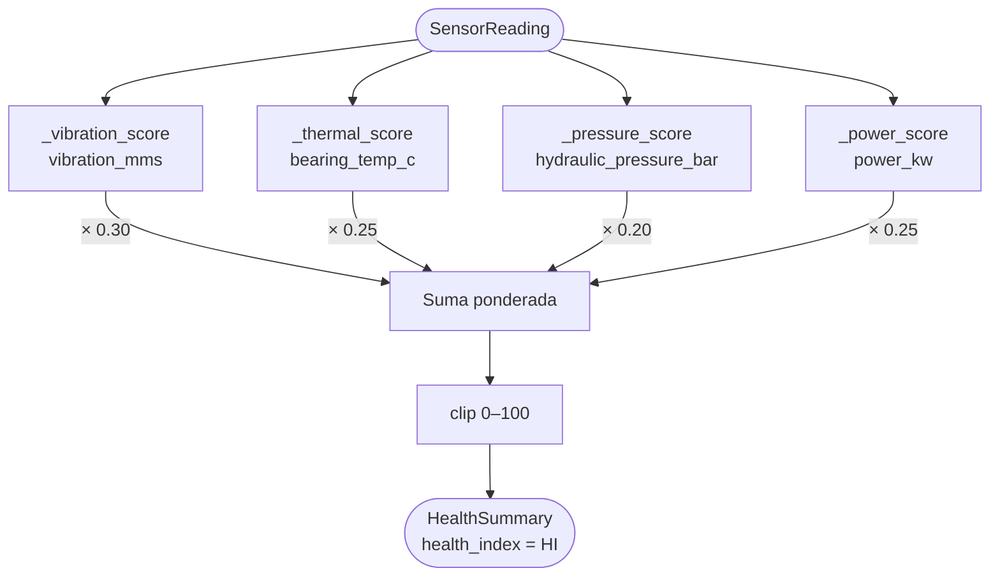

---

### Sub-índice de vibración — ISO 10816

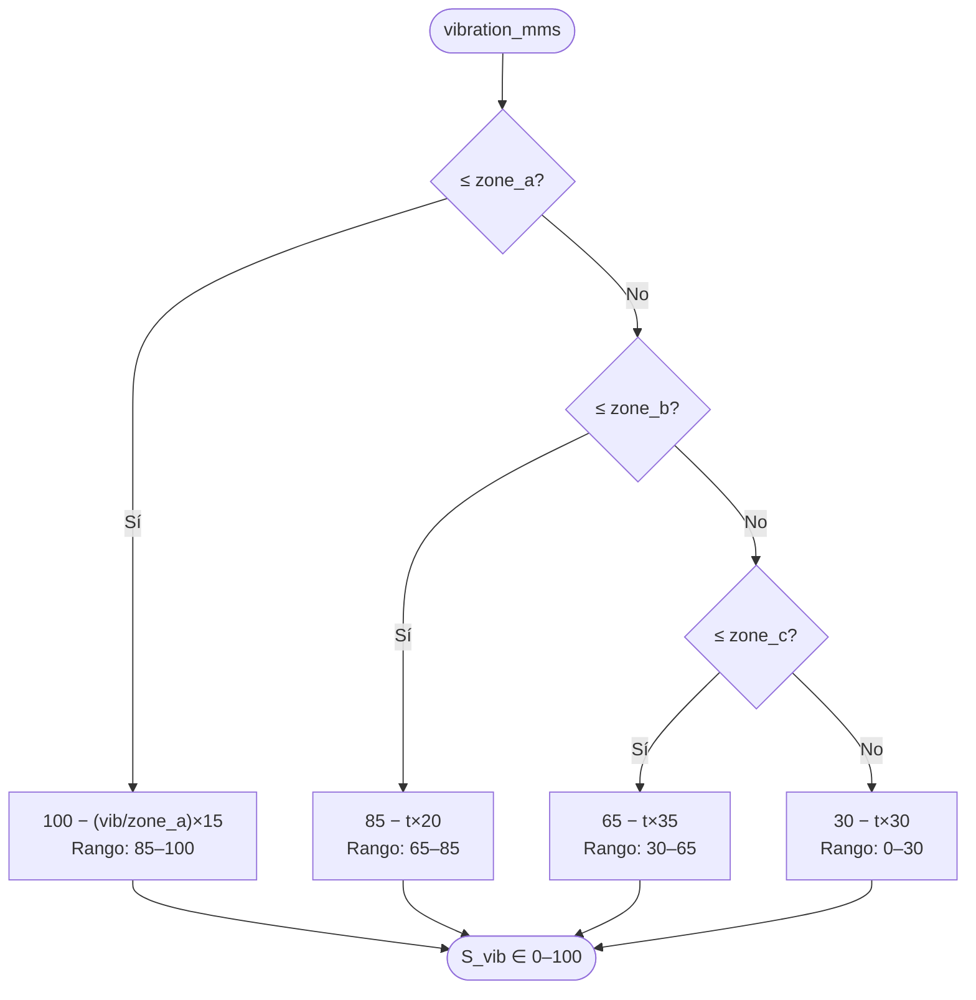

**Zonas ISO 10816 por equipo:**

| Zona | SAG-01 (mm/s) | BALL-01 (mm/s) | Score aprox. |
|---|---|---|---|
| A — Óptimo | ≤ 2.3 | ≤ 1.8 | 85–100 |
| B — Aceptable | ≤ 4.5 | ≤ 3.5 | 65–85 |
| C — Insatisfactorio | ≤ 7.1 | ≤ 5.6 | 30–65 |
| D — Peligro | > 7.1 | > 5.6 | 0–30 |

---

### Sub-índice térmico

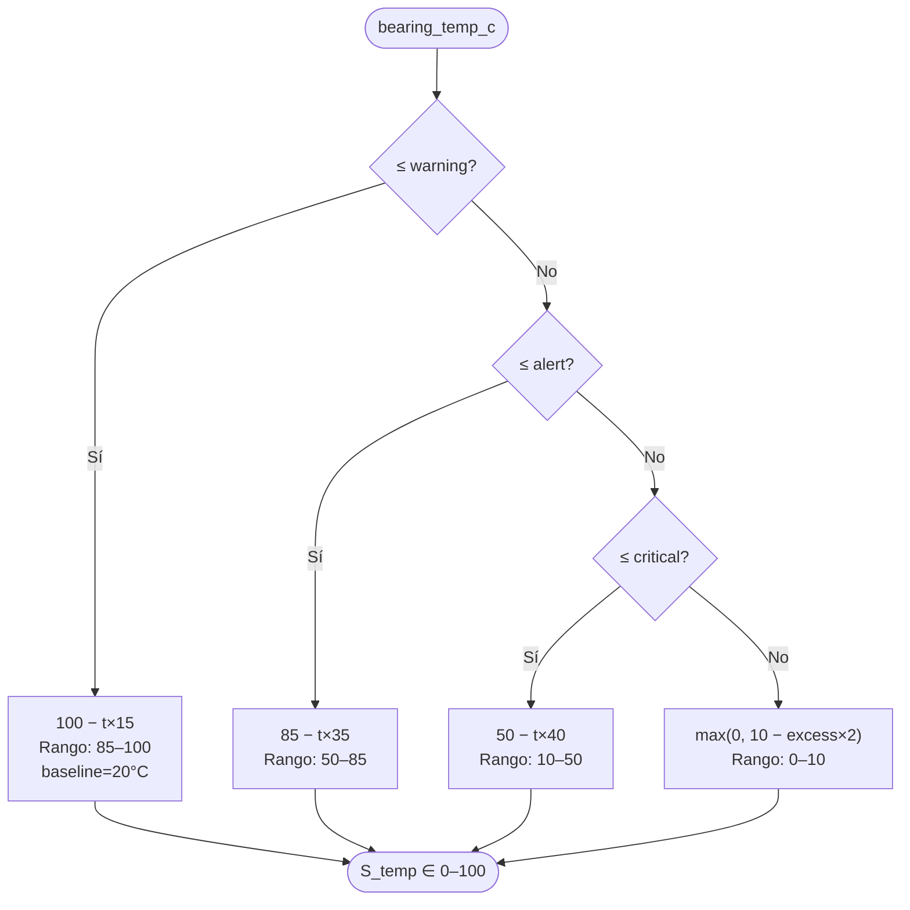

**Umbrales por equipo:**

| Nivel | SAG-01 (°C) | BALL-01 (°C) |
|---|---|---|
| Warning | 72 | 68 |
| Alert | 82 | 78 |
| Critical | 92 | 88 |

---

### Sub-índice de presión hidráulica

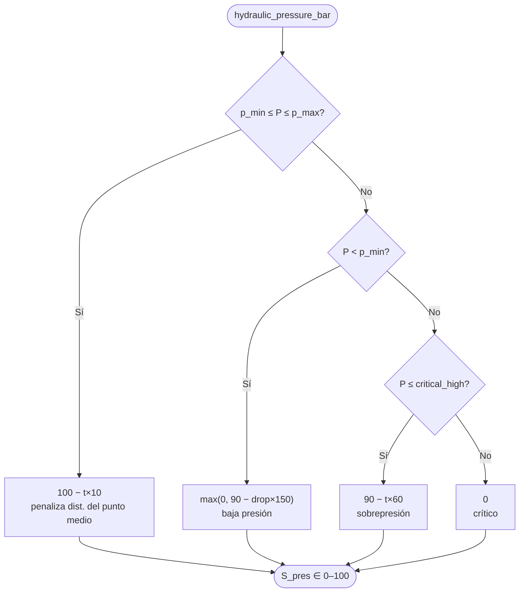

**Rangos operativos:**

| Límite | SAG-01 (bar) | BALL-01 (bar) |
|---|---|---|
| Mínimo | 120 | 80 |
| Máximo | 180 | 140 |
| Crítico alto | 195 | 155 |

---

### Sub-índice de potencia

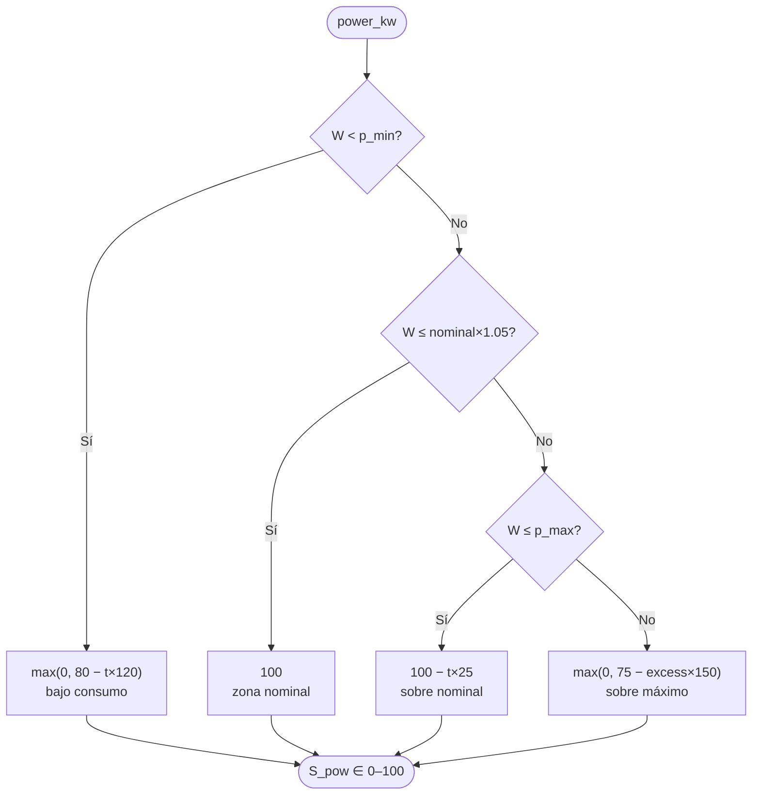

**Potencias nominales:**

| Parámetro | SAG-01 (kW) | BALL-01 (kW) |
|---|---|---|
| Mínimo | 8 000 | 3 000 |
| Nominal | 13 500 | 6 500 |
| Máximo | 15 000 | 7 500 |

---

## 2. Vida Útil Remanente (RUL)

### Definición

Estimación en días hasta que el HI alcanza el umbral crítico de 20. Se calcula mediante extrapolación lineal de la tendencia reciente del HI.

### Algoritmo

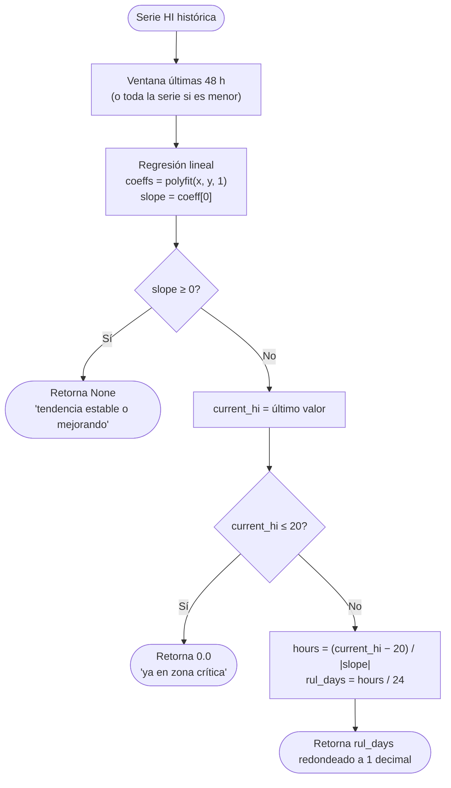

### Parámetros

| Parámetro | Valor | Descripción |
|---|---|---|
| `window_hours` | 48 | Horas de historia usadas para la regresión |
| `critical_threshold` | 20 | HI mínimo antes de considerar falla |
| `min_points` | 4 | Mínimo de puntos para calcular (evita ruido) |

### Interpretación

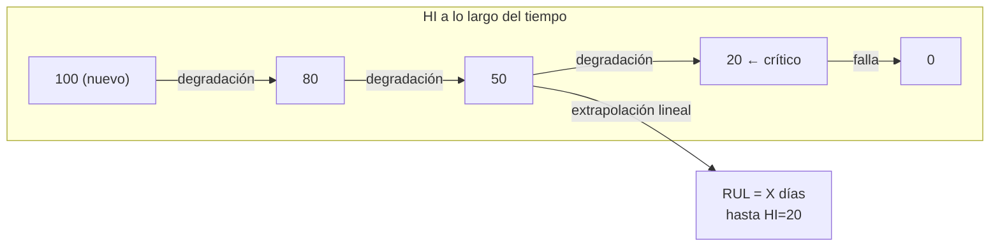

---

## 3. Detección de anomalías

### Definición

Z-score rodante por variable para identificar lecturas estadísticamente inusuales sin depender de umbrales fijos. Complementa el sistema de alertas basado en umbrales ISO.

### Fórmula

```
z(t) = (x(t) − μ_ventana(t)) / σ_ventana(t)

anomalía si |z(t)| > 2.5
```

### Pipeline

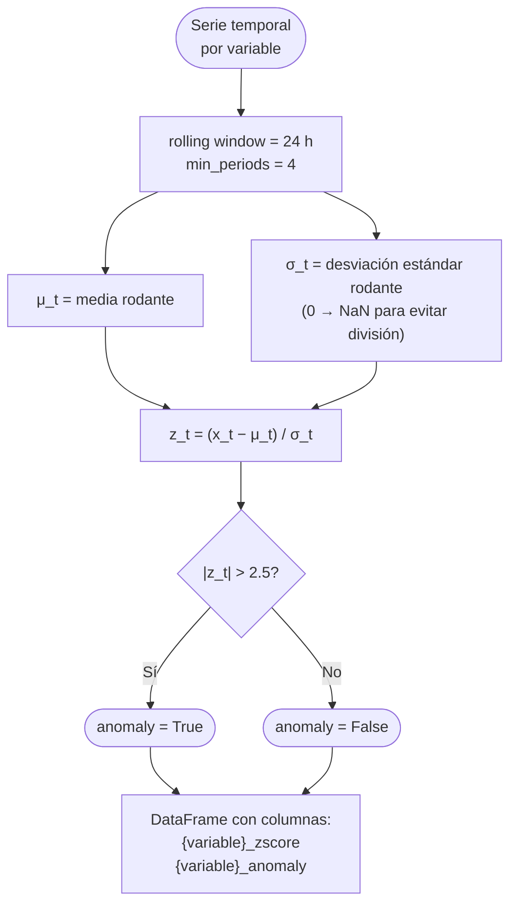

### Detección de períodos

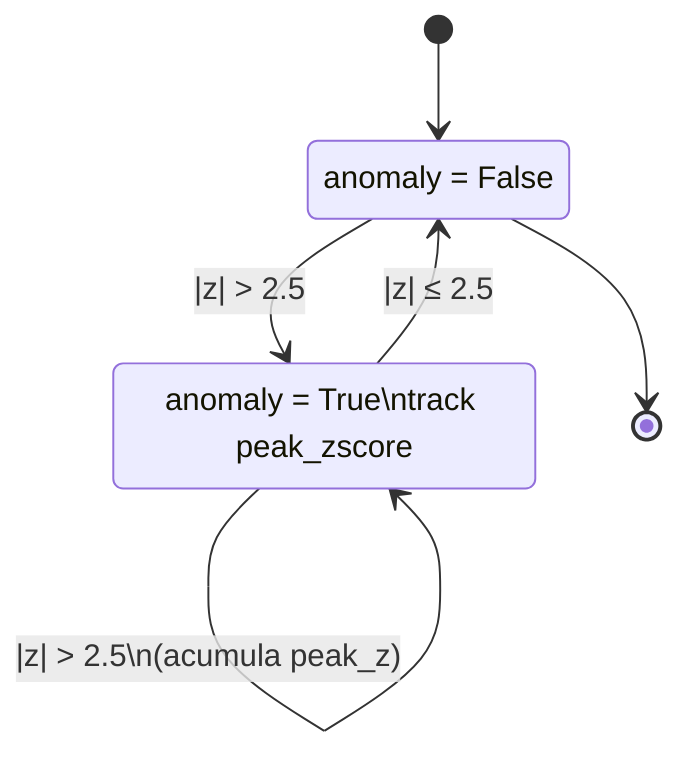

La función `get_anomaly_periods()` extrae períodos discretos con `start`, `end` y `peak_zscore` — usados para sombrear regiones en los gráficos de tendencias.

### Parámetros

| Parámetro | Valor | Descripción |
|---|---|---|
| `window` | 24 | Tamaño de ventana rodante en observaciones (horas) |
| `min_periods` | 4 | Mínimo de obs. para calcular μ y σ |
| `threshold` | 2.5 | Umbral de Z-score para declarar anomalía |

---

## 4. Simulador de datos

El simulador genera historia reproducible con eventos de degradación realistas.

### Arquitectura del simulador

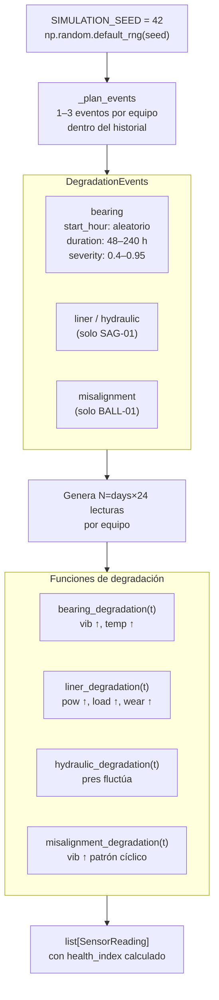

### Parámetros del simulador

| Parámetro | Valor | Descripción |
|---|---|---|
| `SIMULATION_SEED` | 42 | Semilla para reproducibilidad |
| `HISTORY_DAYS` | 90 | Días de historia a generar |
| Eventos por equipo | 1–3 | Degradaciones embebidas en el historial |
| Duración evento | 48–240 h | 2–10 días de degradación continua |
| Severidad pico | 0.4–0.95 | Qué tan grave llega el evento |
| Noise σ (vibración) | 0.15 mm/s SAG | Ruido gaussiano sobre baseline |

---

## 5. Sistema de alertas

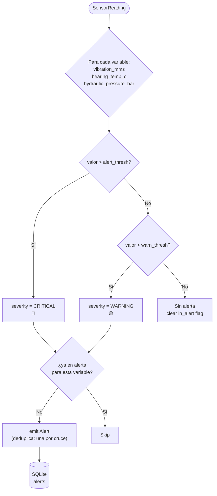

**Severidades disponibles:**

| Severidad | Color | Umbral |
|---|---|---|
| `info` | #58a6ff azul | Informativo |
| `warning` | #e8a020 amarillo | zone_b / temp warning |
| `alert` | #f0883e naranja | zone_c / temp alert |
| `critical` | #da3633 rojo | zone_d / temp critical |
