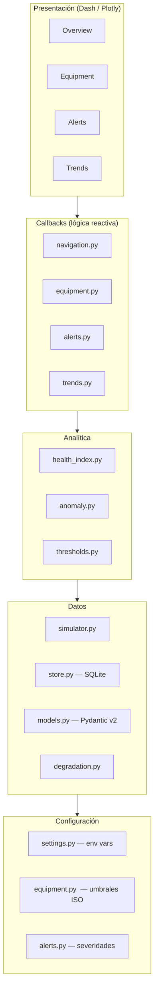
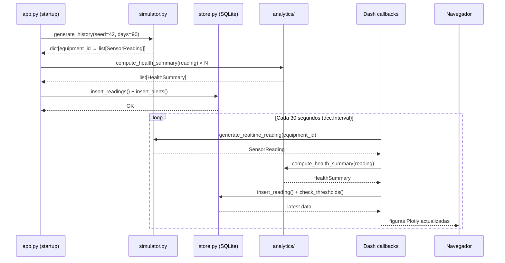
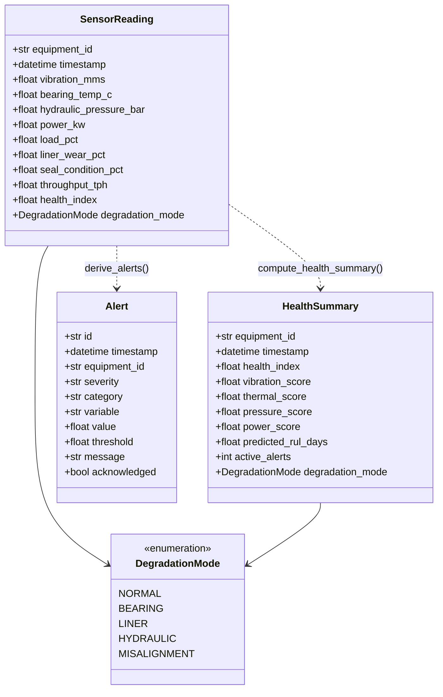
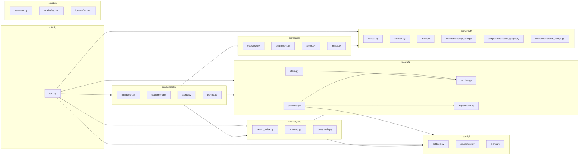
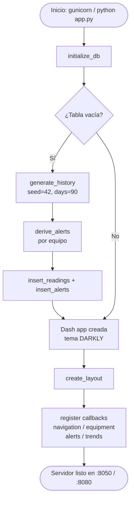
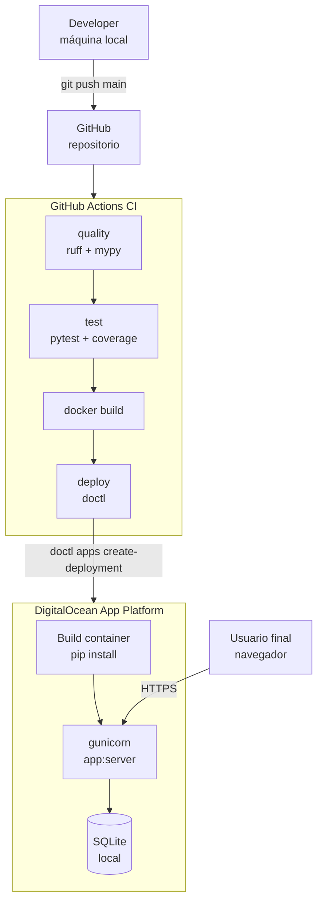
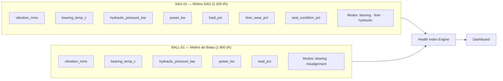

# Arquitectura del sistema

---

## 1. Visión general — Capas del sistema

El sistema está organizado en cuatro capas horizontales. Cada capa depende solo de las que están por debajo de ella.

---

## 2. Flujo de datos completo

Desde la generación del dato en el simulador hasta su visualización en el navegador.

---

## 3. Modelo de dominio

Modelos Pydantic v2 que representan todas las entidades del sistema.

---

## 4. Estructura de módulos

---

## 5. Arranque de la aplicación

Secuencia exacta que ocurre cuando `app.py` se ejecuta o gunicorn lo importa.

---

## 6. Arquitectura de despliegue

---

## 7. Equipos y variables sensoriales

