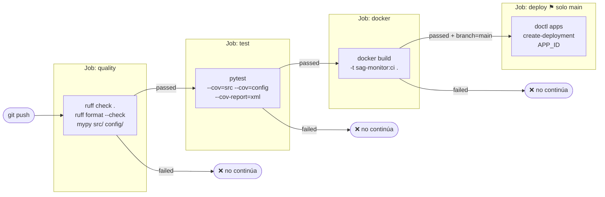

# CI / CD — Integración y entrega continua

Pipeline de GitHub Actions que valida cada cambio y despliega automáticamente a DigitalOcean App Platform cuando el código llega a `main`.

---

## 1. Visión general del pipeline



---

## 2. Triggers del workflow


El job `deploy` tiene una condición explícita:

```yaml
if: github.event_name == 'push' && github.ref == 'refs/heads/main'
```

Los PRs ejecutan todos los checks de calidad pero **nunca despliegan**.

---

## 3. Concurrencia


El bloque `concurrency` cancela runs anteriores del mismo workflow+rama:

```yaml
concurrency:
  group: ${{ github.workflow }}-${{ github.ref }}
  cancel-in-progress: true
```

Esto evita deploys de código obsoleto cuando se hacen pushes rápidos consecutivos.

---

## 4. Job `quality` — Análisis estático

```mermaid
flowchart TD
    CHK[actions/checkout@v4] --> SETUP[setup-python 3.12]
    SETUP --> CACHE[Cache pip\nhash de requirements-dev.txt]
    CACHE --> INST[pip install -r requirements-dev.txt]
    INST --> RUFF_L[ruff check .\nverifica reglas E/F/W/I/UP/B/C4/SIM]
    RUFF_L --> RUFF_F[ruff format --check .\nverifica formato sin modificar]
    RUFF_F --> MYPY[mypy src/ config/\ncontinue-on-error: true]
```

**Reglas ruff activas** (`pyproject.toml`):

| Prefijo | Categoría |
|---|---|
| `E`, `W` | pycodestyle errores y warnings |
| `F` | pyflakes |
| `I` | isort (orden de imports) |
| `UP` | pyupgrade (sintaxis moderna) |
| `B` | flake8-bugbear |
| `C4` | flake8-comprehensions |
| `SIM` | flake8-simplify |

`mypy` corre con `continue-on-error: true` — los errores de tipos son visibles pero no bloquean el pipeline (modo permisivo durante desarrollo inicial).

---

## 5. Job `test` — Suite de tests


**Tests incluidos:**

| Archivo | Qué prueba |
|---|---|
| `tests/test_models.py` | Validaciones Pydantic — rangos, campos obligatorios |
| `tests/test_simulator.py` | Generación de historia y lecturas en tiempo real |
| `tests/test_health_index.py` | Cálculo de HI y sus sub-índices |
| `tests/test_thresholds.py` | Evaluación de umbrales y generación de alertas |

Cobertura objetivo: `src/` y `config/` — excluye `tests/` y `.venv/`.

---

## 6. Job `docker` — Validación de imagen


Este job **no publica** la imagen a ningún registry. Solo verifica que el `Dockerfile` compila correctamente con el código actual. La imagen de producción la construye DigitalOcean directamente desde el código fuente.

---

## 7. Job `deploy` — Despliegue a DigitalOcean


**Secrets y variables requeridos:**

| Nombre | Tipo GitHub | Descripción |
|---|---|---|
| `DIGITALOCEAN_ACCESS_TOKEN` | Secret | Token API personal de DO (Read + Write) |
| `DIGITALOCEAN_APP_ID` | Secret | UUID de la app (`xxxxxxxx-xxxx-...`) |
| `DO_APP_URL` | Variable | URL pública (aparece en environment URL) |

---

## 8. Caché de pip

Ambos jobs `quality` y `test` usan caché de pip para reducir el tiempo de instalación en runs posteriores.


La clave incluye el hash de `requirements-dev.txt`. Si cambian las dependencias, la caché se invalida automáticamente.

---

## 9. Archivo completo anotado

```yaml
name: CI / CD

on:
  push:
    branches: [main, develop]   # ← corre en ambas ramas
  pull_request:
    branches: [main]            # ← PRs solo contra main

concurrency:
  group: ${{ github.workflow }}-${{ github.ref }}
  cancel-in-progress: true      # ← cancela runs anteriores del mismo ref

jobs:

  quality:                       # ── JOB 1 ──────────────────────────────────
    name: Lint & Type Check
    runs-on: ubuntu-latest
    steps:
      - uses: actions/checkout@v4

      - uses: actions/setup-python@v5
        with:
          python-version: "3.12"

      - uses: actions/cache@v4
        with:
          path: ~/.cache/pip
          key: ${{ runner.os }}-pip-${{ hashFiles('requirements-dev.txt') }}
          restore-keys: |
            ${{ runner.os }}-pip-

      - run: pip install -r requirements-dev.txt

      - run: ruff check .                  # ← falla → pipeline se detiene
      - run: ruff format --check .         # ← falla → pipeline se detiene
      - run: mypy src/ config/
        continue-on-error: true            # ← falla → sigue (permisivo)

  test:                          # ── JOB 2 ──────────────────────────────────
    runs-on: ubuntu-latest
    needs: quality               # ← depende de quality

    steps:
      - uses: actions/checkout@v4
      - uses: actions/setup-python@v5
        with: { python-version: "3.12" }
      - uses: actions/cache@v4
        with:
          path: ~/.cache/pip
          key: ${{ runner.os }}-pip-${{ hashFiles('requirements-dev.txt') }}
          restore-keys: ${{ runner.os }}-pip-
      - run: pip install -r requirements-dev.txt
      - run: pytest --cov=src --cov=config --cov-report=term-missing --cov-report=xml

      - uses: actions/upload-artifact@v4   # ← sube coverage.xml
        with:
          name: coverage-xml
          path: coverage.xml
          retention-days: 7

  docker:                        # ── JOB 3 ──────────────────────────────────
    runs-on: ubuntu-latest
    needs: test                  # ← depende de test

    steps:
      - uses: actions/checkout@v4
      - run: docker build -t sag-monitor:ci .   # ← valida Dockerfile

  deploy:                        # ── JOB 4 ──────────────────────────────────
    runs-on: ubuntu-latest
    needs: docker                # ← depende de docker
    if: github.event_name == 'push' && github.ref == 'refs/heads/main'
    environment:
      name: production
      url: ${{ vars.DO_APP_URL }}

    steps:
      - uses: digitalocean/action-doctl@v2
        with:
          token: ${{ secrets.DIGITALOCEAN_ACCESS_TOKEN }}

      - run: doctl apps create-deployment ${{ secrets.DIGITALOCEAN_APP_ID }}
```

---

## 10. Estrategia de ramas


| Rama | CI | Deploy |
|---|---|---|
| `main` | quality + test + docker | **Sí** |
| `develop` | quality + test + docker | No |
| PR a `main` | quality + test + docker | No |
| Cualquier otra | No | No |
