# Arquitectura de datos y flujo de procesamiento

Documentación exhaustiva de los dos pipelines de datos del sistema — el pipeline batch de inicialización y el pipeline de tiempo real — con énfasis en las decisiones de ingeniería de datos.

---

## 1. Visión general: dos pipelines

El sistema tiene una arquitectura de datos de **dos velocidades** (inspirada en Lambda Architecture):

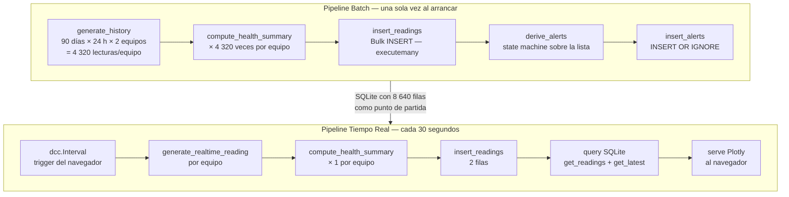

---

## 2. Pipeline Batch — Inicialización

### 2.1 Punto de entrada

`initialize_db()` en `store.py` es llamado una sola vez desde `app.py` al arrancar. Es **idempotente**: si la tabla ya tiene filas, no hace nada.

```python
# app.py
initialize_db()   # ← esta línea desencadena todo el pipeline batch
```

### 2.2 Paso 1 — `generate_history()`: generación vectorizada por equipo

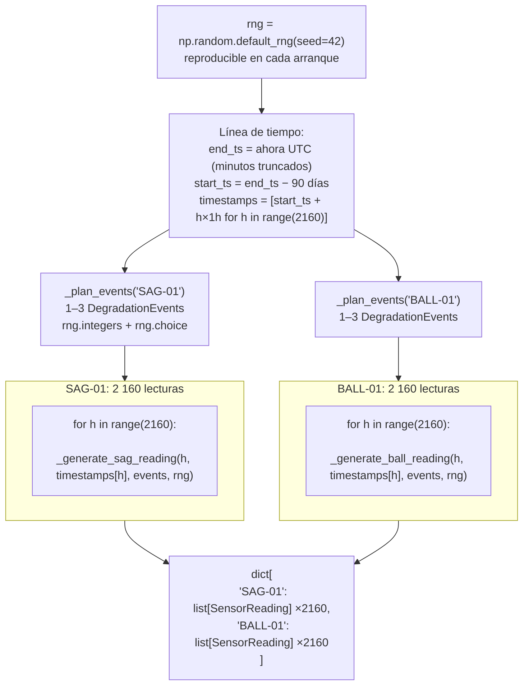

**Decisión clave — loops Python vs NumPy vectorizado:**

El generador usa loops Python (`for h in range(2160)`) en lugar de operaciones vectorizadas de NumPy porque cada lectura depende de qué eventos de degradación están activos en `h`. La condición `_degradation_progress(h, event)` no es trivialmente vectorizable y mantener la claridad del modelo físico por hora era prioritario sobre la velocidad de generación (que ocurre una sola vez).

---

### 2.3 Paso 2 — `compute_health_summary(reading) × N`: el loop central

Este es el núcleo del pipeline batch. Por cada lectura generada, se calcula su Índice de Salud y se escribe de vuelta en el objeto:

```python
# store.py — initialize_db()
for equipment_id, reading_list in history.items():     # 2 equipos
    for reading in reading_list:                       # 2 160 lecturas
        summary = compute_health_summary(reading)      # ← función pura
        reading.health_index = summary.health_index    # ← mutación del objeto
    insert_readings(reading_list)                      # ← bulk después del loop
```

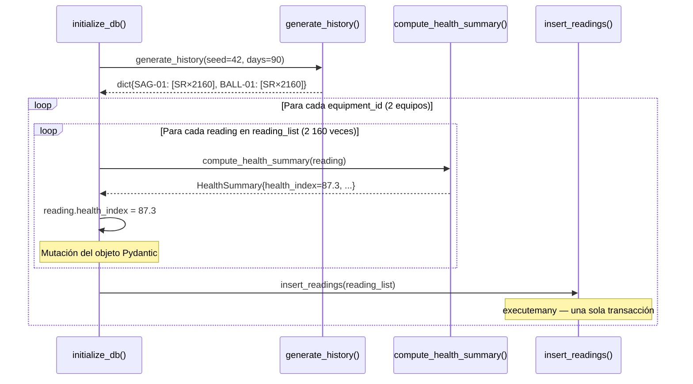

**Por qué se muta `reading.health_index` en lugar de guardar el `HealthSummary`:**

`HealthSummary` tiene 8 campos calculados (scores parciales, RUL, etc.). Para el pipeline histórico solo interesa `health_index` — los scores parciales y el RUL no se guardan en BD para las lecturas históricas. Persistir un `HealthSummary` completo requeriría una segunda tabla o columnas adicionales, aumentando el costo de almacenamiento y queries sin beneficio operacional.

La denormalización de `health_index` en `SensorReading` es una **decisión de ingeniería de datos deliberada**: el patrón de acceso dominante es "dame la serie temporal de health_index junto a vibration_mms" — un JOIN sería costoso para cada render del dashboard.

**Conteo de llamadas totales en startup:**

```
2 equipos × 2 160 lecturas = 4 320 llamadas a compute_health_summary()
```

`compute_health_summary()` es una función pura (sin side effects, sin I/O, sin estado). Esto la hace segura para llamar 4 320 veces sin riesgo de efectos acumulados.

---

### 2.4 Paso 3 — `insert_readings()`: escritura bulk

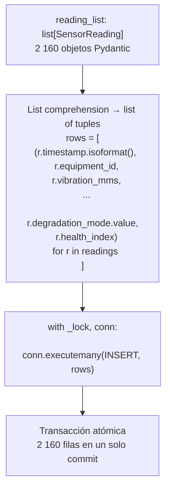

**Por qué `executemany` y no un loop de `execute`:**

`executemany` envía todas las filas en una sola transacción. Un loop de `execute` haría un commit por fila → 2 160 transacciones separadas → ~100× más lento para SQLite. Con `executemany`, el costo es prácticamente el de una sola transacción.

**Por qué `.isoformat()` y no pasar el `datetime` directamente:**

SQLite no tiene tipo `DATETIME`. El driver `sqlite3` de Python puede hacer la conversión automáticamente si se activa `detect_types`, pero esto tiene un costo de parsing en cada lectura. Se prefiere texto ISO 8601 explícito: es ordenable lexicográficamente (`ORDER BY timestamp ASC` sin conversión), universalmente legible, y el código de lectura hace la conversión una sola vez (`pd.to_datetime(df["timestamp"], utc=True)`).

---

### 2.5 Paso 4 — `derive_alerts()`: máquina de estados sobre la lista completa

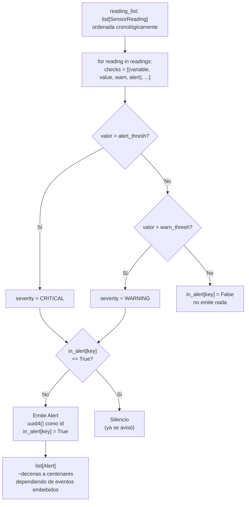

**El estado `in_alert` es crítico:** sin él, cada lectura anómala generaría una alerta, produciendo miles de alertas por evento de degradación. La máquina de estados garantiza que se emite exactamente **una alerta por cruce de umbral**, independientemente de cuántas lecturas consecutivas superen el umbral.

---

## 3. Pipeline de Tiempo Real — cada 30 segundos

### 3.1 Trigger: `dcc.Interval`

Dash tiene un componente `dcc.Interval` que dispara un evento en el navegador cada `UPDATE_INTERVAL_MS` (30 000 ms por defecto). Este evento activa callbacks en el servidor Python vía WebSocket:

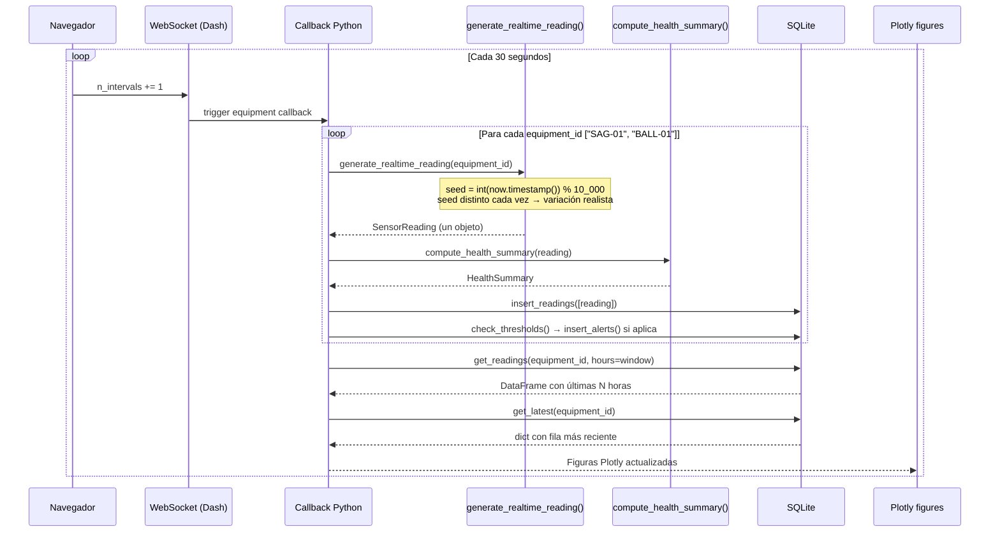

### 3.2 `generate_realtime_reading()` — diseño de la semilla

```python
def generate_realtime_reading(equipment_id: str) -> SensorReading:
    seed = int(datetime.now(tz=timezone.utc).timestamp()) % 10_000
    rng = np.random.default_rng(seed)
    ts = datetime.now(tz=timezone.utc).replace(second=0, microsecond=0)
    ...
```

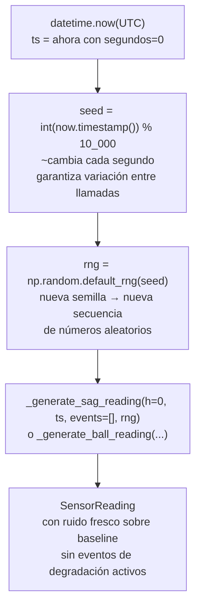

**Decisión clave — `events=[]` en tiempo real:**

Las lecturas en tiempo real siempre se generan sin eventos de degradación activos (`events=[]`). Esto refleja la intención del sistema: el dashboard muestra el estado **actual** de la planta, que en la demo siempre es operación normal. Los eventos de degradación viven solo en el historial (los 90 días) para dar contexto a las páginas de tendencias y alertas.

**Decisión clave — `% 10_000`:**

El módulo 10 000 garantiza que la semilla sea un número manejable (evita problemas con semillas muy grandes en algunos backends de NumPy) y que cambie en cada llamada al callback (que ocurre cada 30 segundos, y el timestamp en segundos cambia siempre).

---

### 3.3 Patrón de lectura: separación write path / read path

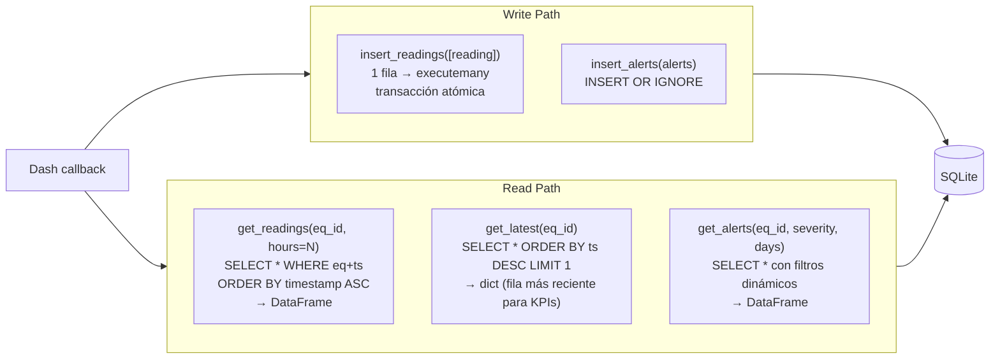

**Por qué `get_latest` retorna `dict` y no `DataFrame`:**

`get_latest` se usa para KPIs instantáneos (ej. "temperatura actual: 71.2°C"). Crear un DataFrame de una sola fila tiene overhead de pandas (metadata, dtypes, indexing). Un `dict` es suficiente y más eficiente para acceso por nombre de columna (`row["bearing_temp_c"]`).

**Por qué `get_readings` siempre retorna `DataFrame`:**

Todas las visualizaciones de series temporales en Plotly esperan DataFrames con columna `timestamp`. La conversión `pd.to_datetime(df["timestamp"], utc=True)` se hace una sola vez en el store, no en cada callback. Delegar la conversión al store centraliza la lógica de parsing.

---

## 4. Arquitectura de datos — Vista de ingeniero de datos

### 4.1 Flujo end-to-end

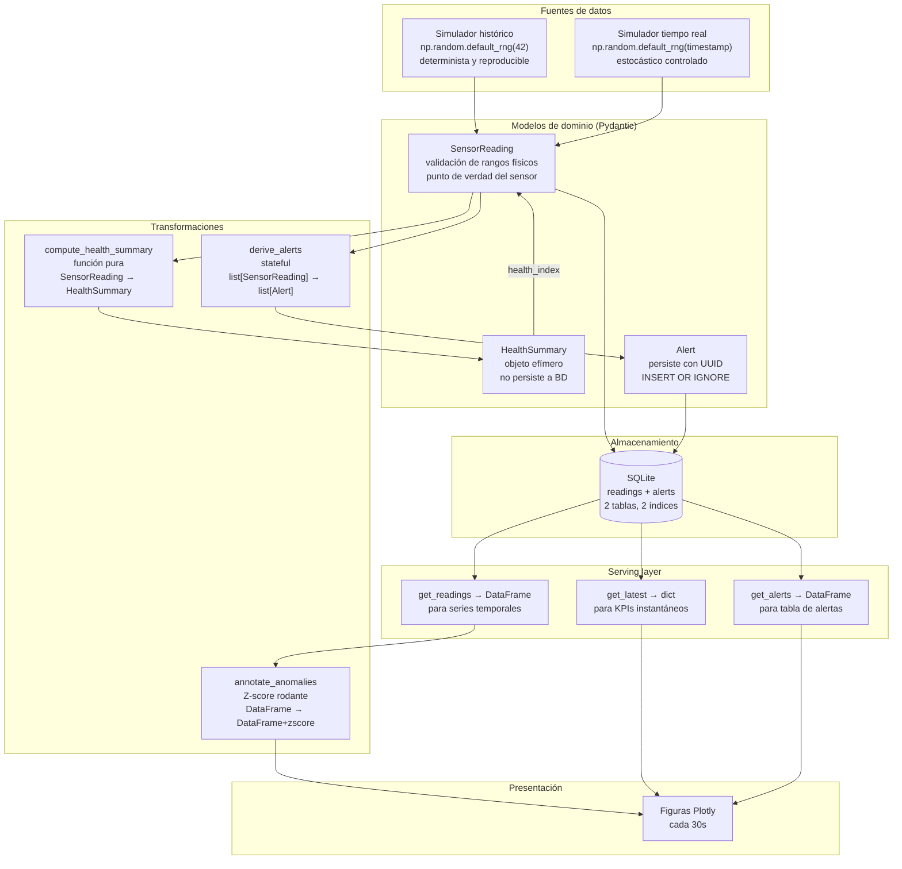

### 4.2 Inmutabilidad vs. mutación — la única excepción

El diseño favorece la inmutabilidad. La **única mutación explícita** del sistema ocurre en el pipeline batch:

```python
reading.health_index = summary.health_index
```

Esta mutación es aceptable porque:
1. Ocurre antes de que el objeto llegue a la BD — no hay copia "limpia" que proteger.
2. Es más eficiente que crear 4 320 nuevos objetos `SensorReading` solo para actualizar un campo.
3. El scope es local al loop de `initialize_db()` — no escapa a otros módulos.

Pydantic v2 por defecto permite mutación (`model_config = ConfigDict(frozen=False)`). Si en el futuro se quiere inmutabilidad total, se puede usar `frozen=True` y reemplazar la mutación por `reading = reading.model_copy(update={"health_index": summary.health_index})`.

### 4.3 Cardinalidades en estado de steady-state

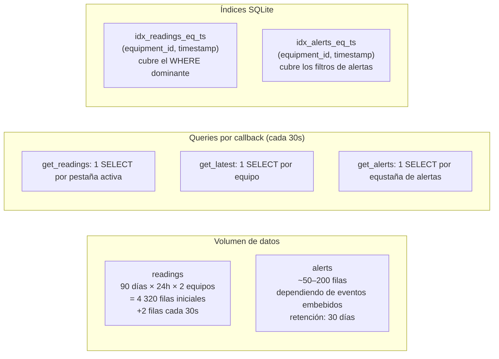

Después de un año de operación continua (si la instancia no se reinicia):

```
readings = 4 320 (histórico) + (365 × 24 × 2) × 2 = 4 320 + 35 040 ≈ 39 360 filas
```

SQLite maneja cómodamente este volumen. El índice compuesto `(equipment_id, timestamp)` garantiza que todos los queries de series temporales sean O(log n) independientemente del volumen total.

### 4.4 Consistencia de datos — garantías del diseño

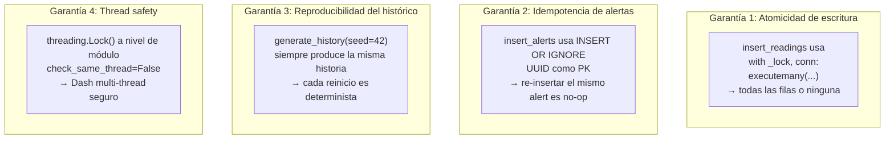

### 4.5 Limitaciones de diseño conocidas

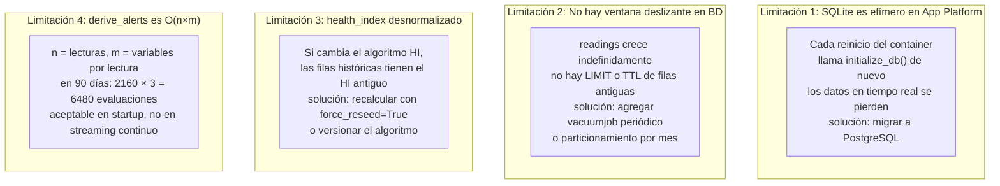
