# Modelo de datos — Contexto, abstracciones y decisiones de diseño

Este documento explica **por qué** el sistema está modelado como está, no solo **qué** contiene cada clase. Cada decisión de modelado tiene raíces en el dominio del problema: el monitoreo de condición de maquinaria giratoria pesada.

---

## 1. El problema de dominio

Un molino SAG o de Bolas es una máquina de miles de toneladas que gira continuamente. Su falla no es instantánea: la degradación sigue una curva característica de semanas o meses. El sistema debe:

1. **Capturar** el estado del equipo a través de múltiples sensores cada hora.
2. **Calcular** qué tan sano está el equipo en ese instante.
3. **Detectar** cuando una variable se sale de los rangos seguros.
4. **Predecir** cuánto tiempo queda antes de que el estado sea crítico.

Esto define exactamente tres objetos de dominio principales:

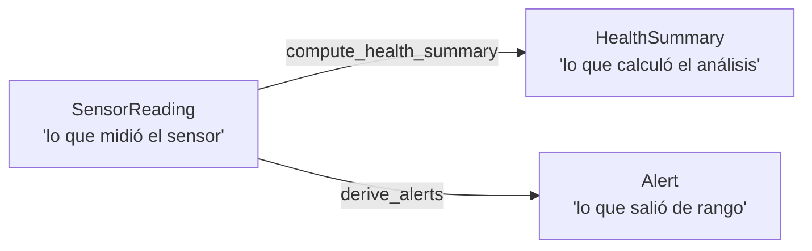

Todo lo demás en el sistema es configuración, utilidades, o infraestructura para servir a estos tres.

---

## 2. Mapa completo de abstracciones

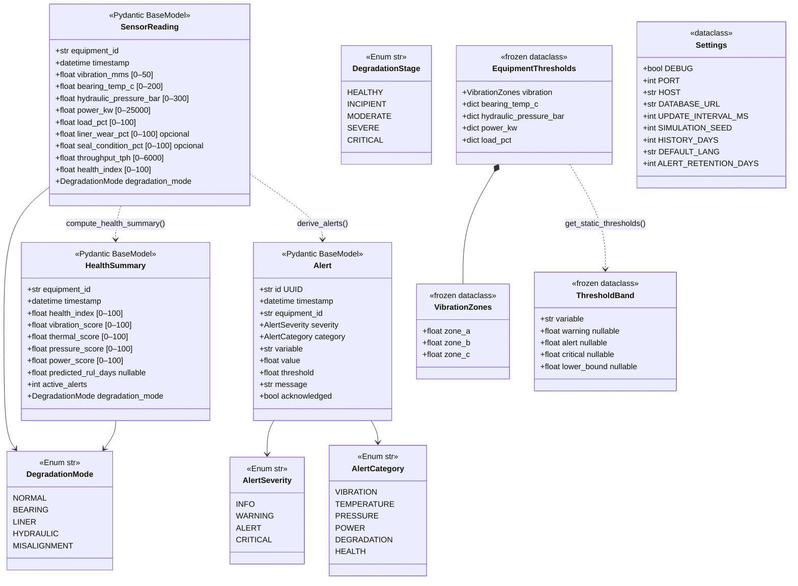

---

## 3. `SensorReading` — El objeto central

### Por qué Pydantic v2

`SensorReading` usa `Pydantic BaseModel` porque es el punto de entrada de datos del mundo exterior. Los sensores pueden enviar valores fuera de rango, `NaN`, o tipos incorrectos. Pydantic valida en el borde del sistema:

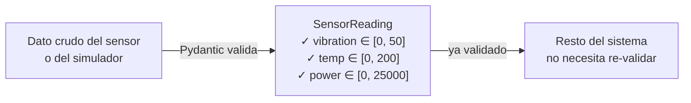

Los objetos internos (como `ThresholdBand` o `EquipmentThresholds`) **no** usan Pydantic porque no provienen de fuentes externas y no necesitan validación en tiempo de ejecución.

### Por qué `health_index` vive en `SensorReading`

En teoría, el HI es un dato analítico derivado, no un dato sensorial. Pero se incluyó en `SensorReading` por una razón pragmática: el esquema SQLite tiene una sola tabla `readings`, y el HI debe ser consultable junto a las variables sensoriales en la misma fila para las series temporales del dashboard.

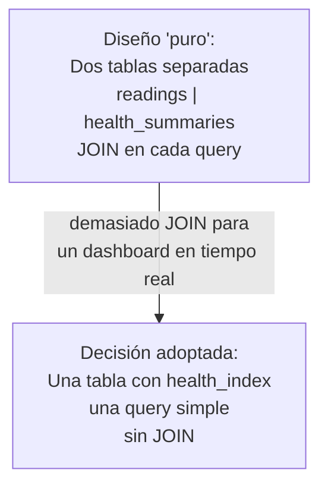

Es una **desnormalización intencional** justificada por el patrón de acceso dominante: siempre se necesitan ambos datos juntos.

### Por qué `liner_wear_pct` y `seal_condition_pct` son opcionales

Solo el Molino SAG (`SAG-01`) tiene sensores de desgaste de liner y condición de sellos. El Molino de Bolas no los tiene. En lugar de crear dos clases separadas `SAGReading` y `BallReading`, se optó por **una sola clase con campos opcionales**:

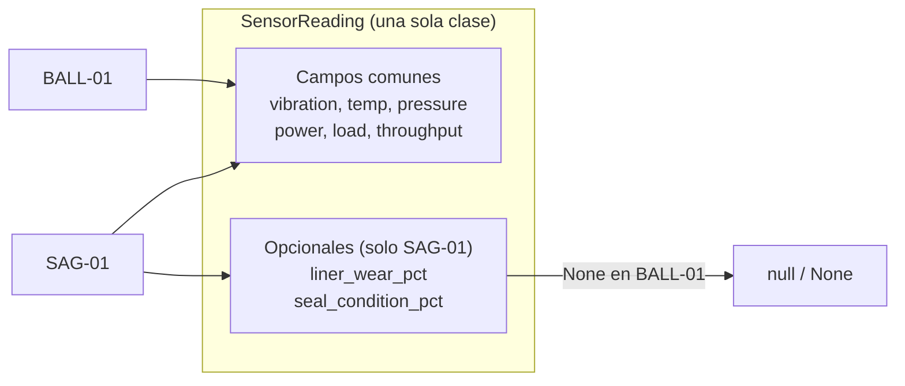

Razón: los equipos comparten el 80% de las variables. Mantener una jerarquía de herencia solo para dos campos opcionales añadiría complejidad sin beneficio.

---

## 4. `HealthSummary` — Resultado analítico

### Por qué existe separado de `SensorReading`

`HealthSummary` es el resultado de aplicar el motor analítico sobre un `SensorReading`. Separarlo en un objeto distinto sigue el principio de **separación de responsabilidades**:

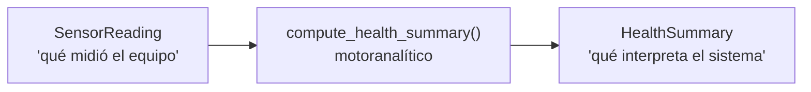

`SensorReading` es **inmutable en el tiempo** (es el registro histórico del sensor). `HealthSummary` podría recalcularse si el algoritmo cambia — no es el estado del equipo, sino la interpretación del sistema de ese estado.

### Por qué `predicted_rul_days` es `Optional[float]`

El RUL (`Remaining Useful Life`) solo tiene sentido cuando la tendencia del HI es decreciente. Si el equipo está estable o mejorando, no tiene sentido hablar de "días hasta la falla". El `None` no es un dato faltante — es un valor semánticamente significativo: "tendencia positiva, no aplica RUL".

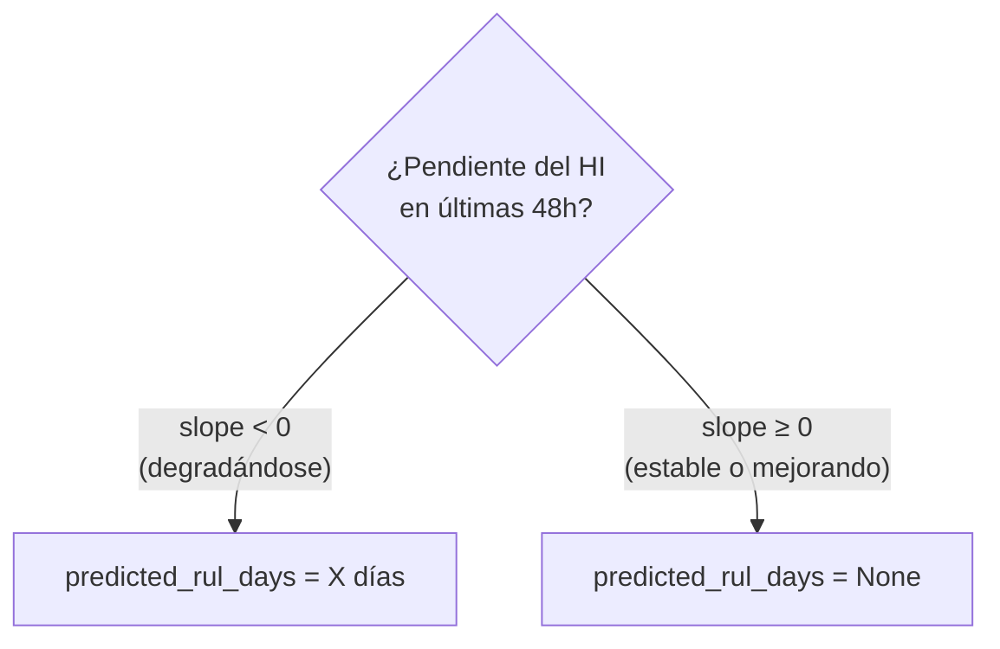

---

## 5. `Alert` — Evento de umbral cruzado

### Decisión de deduplicación

Una alerta no es "cada lectura que supera el umbral" — eso generaría cientos de alertas por minuto y haría el sistema inutilizable. Una alerta es **el cruce del umbral**: el momento en que la variable pasa de normal a anormal.

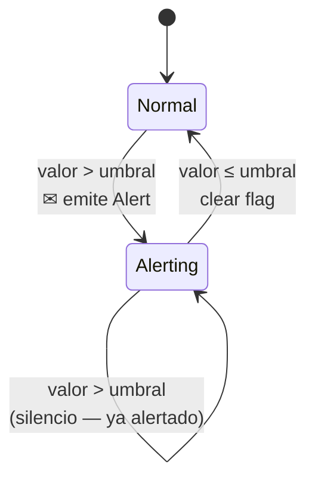

Esto se implementa con un diccionario de estado `in_alert: dict[str, bool]` por variable+equipo. La clave de decisión fue: **el operador recibe UNA alerta por evento**, no una por lectura.

### Por qué `id` es UUID string y no autoincrement

Los `Alert.id` se generan con `uuid.uuid4()` en el simulador, antes de insertarlos. Esto permite:

1. Crear alertas en memoria y asignarles ID sin necesidad de una inserción previa en BD.
2. Usar `INSERT OR IGNORE` en SQLite para idempotencia — el mismo alert no se duplica aunque se llame dos veces.
3. La columna en SQLite es `TEXT PRIMARY KEY`, que aprovecha exactamente esa garantía.

En contraste, `readings` usa `INTEGER PRIMARY KEY AUTOINCREMENT` porque las lecturas siempre se insertan en secuencia y la BD es la fuente de verdad del ID.

---

## 6. Enumeraciones — Por qué `str, Enum`

Todas las enumeraciones heredan de `(str, Enum)`, no de `Enum` puro:

```python
class DegradationMode(str, Enum):
    BEARING = "bearing"
```

Esto tiene tres consecuencias directas:

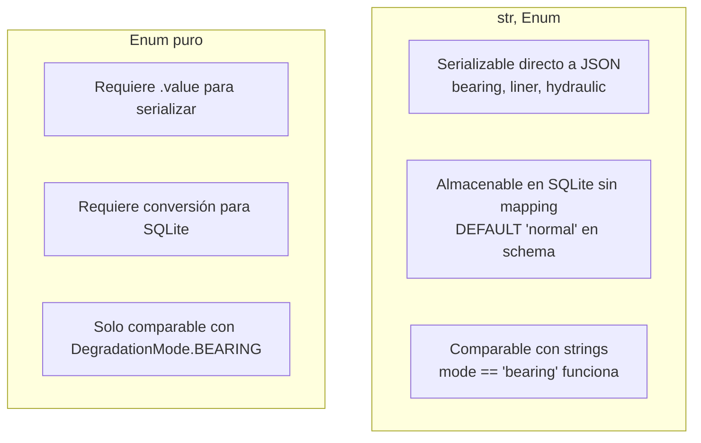

### `DegradationMode` — Estados de la máquina

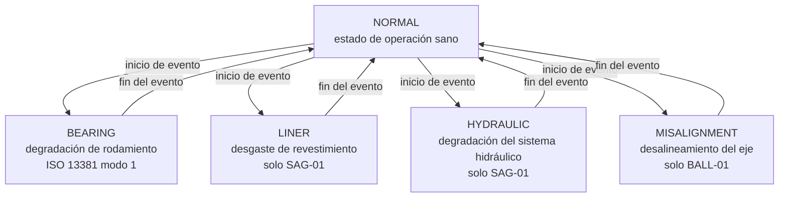

Solo puede estar activo **un modo a la vez** por equipo (el simulador tiene un `break` explícito para garantizarlo).

### `DegradationStage` — Progreso dentro de un modo

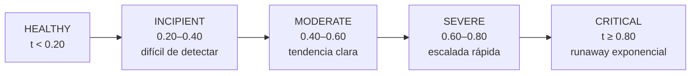

`DegradationStage` no se almacena en BD. Es una abstracción del simulador (`classify_stage(t)`) que describe en qué parte de la curva de vida está el evento de degradación, y determina qué modelo físico aplicar.

---

## 7. Configuración — Tres niveles de abstracción

El sistema usa tres tipos de objetos de configuración con propósito distinto:

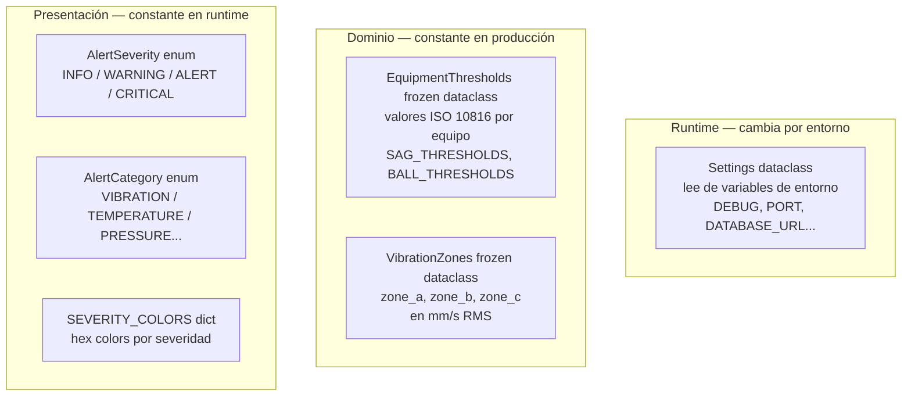

### Por qué `EquipmentThresholds` es un `frozen dataclass` y no Pydantic

Los umbrales del equipo son constantes de ingeniería derivadas de la ISO 10816. No provienen de una fuente externa en runtime — están definidos en el código. Pydantic añadiría overhead de validación innecesario para datos que nunca cambian.

`frozen=True` garantiza que ninguna parte del sistema pueda modificar accidentalmente los umbrales:

```python
@dataclass(frozen=True)
class VibrationZones:
    zone_a: float  # modificar esto lanzaría FrozenInstanceError
```

### Por qué `Settings` es un `dataclass` simple (no Pydantic, no frozen)

`Settings` lee de variables de entorno con `os.getenv`. Las conversiones de tipo (`int(os.getenv(...))`) ya fallan explícitamente si el valor es inválido. No necesita la maquinaria de validación de Pydantic. Y `frozen=False` porque se instancia una vez como singleton `settings = Settings()`.

---

## 8. `ThresholdBand` — Objeto de valor para visualización

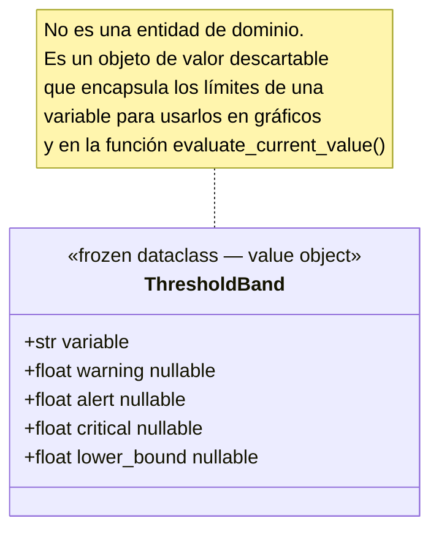

`ThresholdBand` existe porque distintas variables tienen estructuras de umbral diferentes:

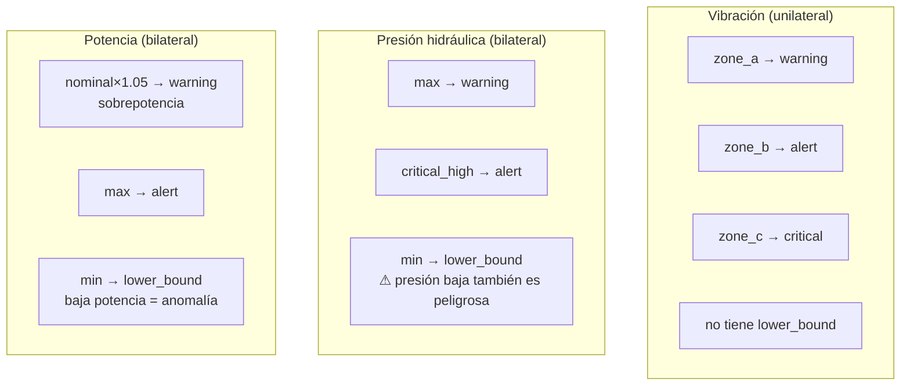

Un único objeto `ThresholdBand` con campos opcionales unifica estas estructuras distintas, permitiendo que `evaluate_current_value()` y el renderizado de gráficos usen la misma interfaz.

---

## 9. Modelos físicos de degradación

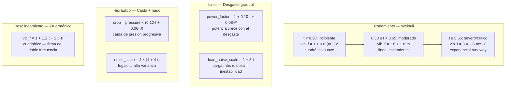

El parámetro `t ∈ [0, 1]` es el **progreso normalizado** dentro del evento de degradación. Ningún modelo físico conoce el tiempo absoluto, solo qué fracción del evento ha transcurrido. Esto hace los modelos independientes de la escala temporal.

---

## 10. Esquema de base de datos

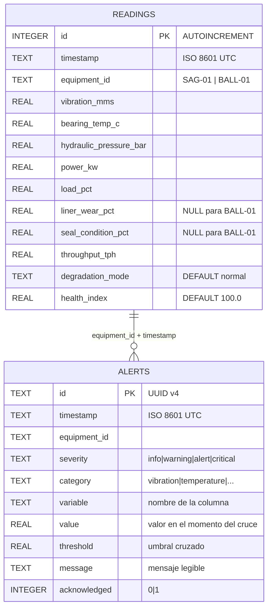

### Decisiones del esquema

**`timestamp` como `TEXT`** (ISO 8601) en lugar de `INTEGER` (epoch): SQLite no tiene tipo nativo `DATETIME`. ISO 8601 es ordenable lexicográficamente, lo que permite hacer `ORDER BY timestamp ASC` sin conversión. El código convierte a `pd.Timestamp` al leer.

**Índice compuesto `(equipment_id, timestamp)`** en ambas tablas: el patrón de acceso dominante es siempre "últimas N horas de un equipo específico". El índice compuesto con este orden satisface ese query directamente.

**`INSERT OR IGNORE` para alertas**: las alertas tienen ID UUID generado antes de insertar. Si se llama `initialize_db()` dos veces (reinicio del container), el `OR IGNORE` evita duplicados sin necesidad de verificar primero.

---

## 11. Thread safety en el store

Dash ejecuta callbacks en múltiples hilos concurrentes. El store usa dos mecanismos complementarios:

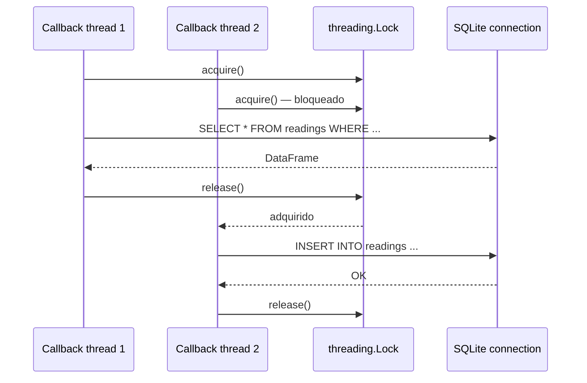

- `check_same_thread=False` en `sqlite3.connect()`: permite que múltiples hilos usen la misma conexión.
- `threading.Lock()` a nivel de módulo: garantiza que solo un hilo ejecuta una operación de BD a la vez.

La conexión es un **singleton de módulo** (`_DB`), creada una vez y reutilizada en todos los callbacks. Crear una conexión por callback sería costoso e innecesario para SQLite.
