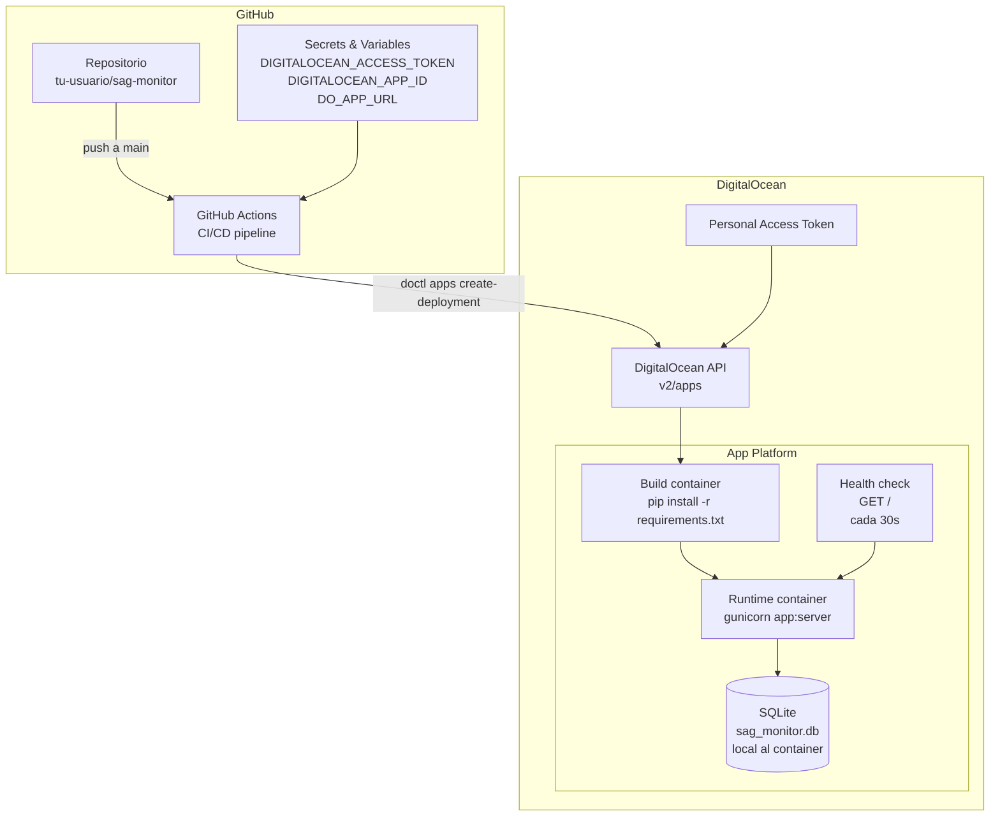
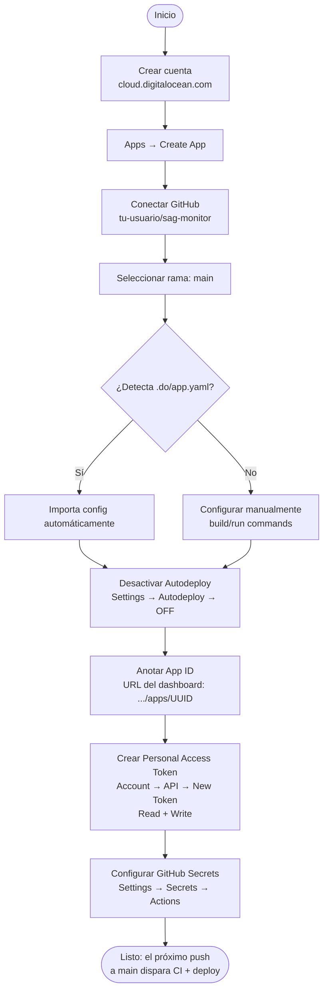
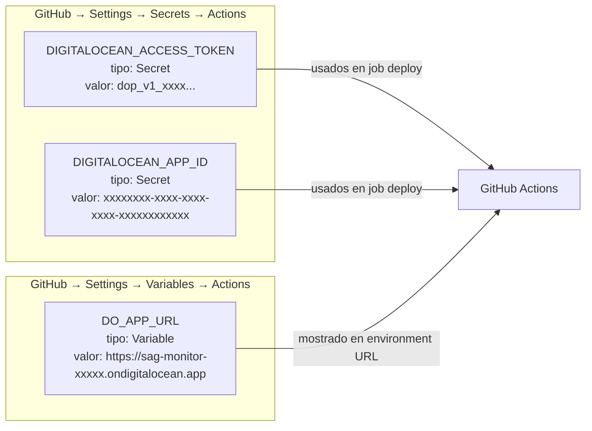
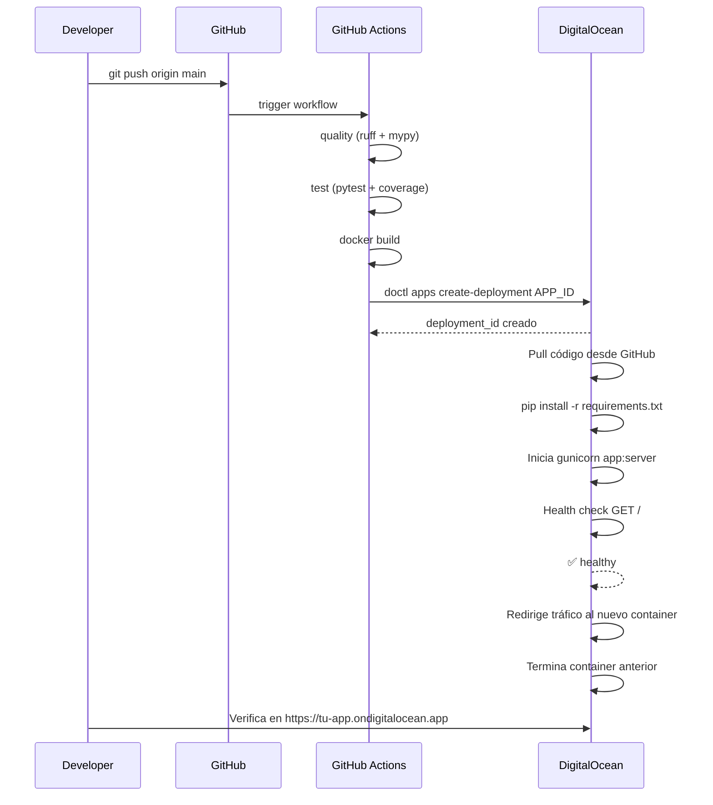
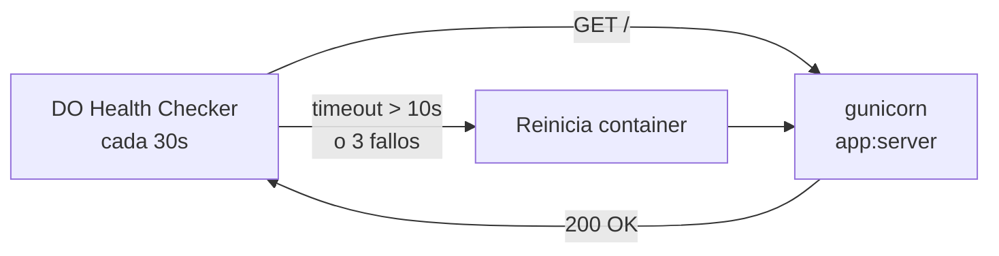
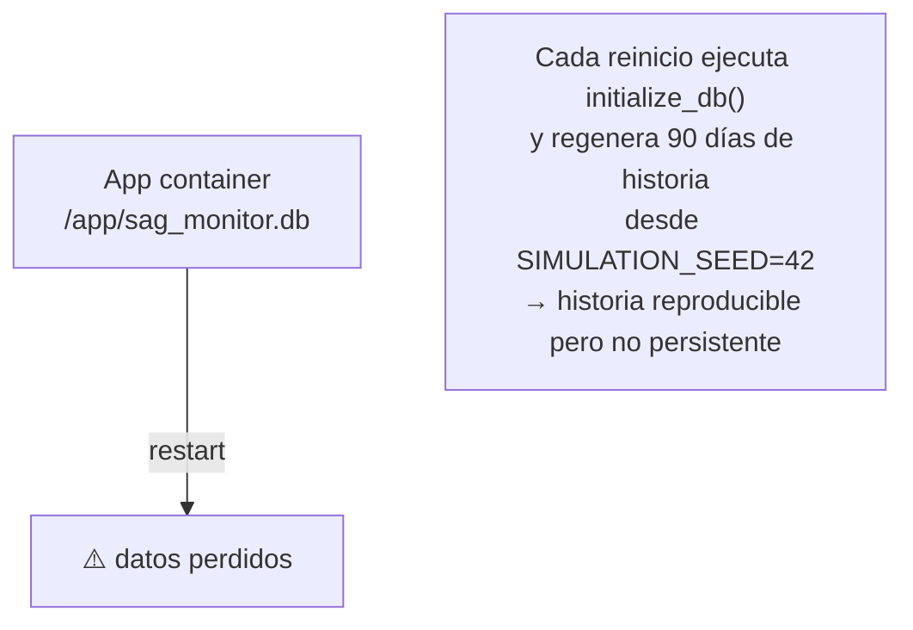

# Deployment — DigitalOcean App Platform

Guía completa de configuración, operación y troubleshooting del entorno de producción.

---

## 1. Arquitectura de producción



---

## 2. Archivo `.do/app.yaml` — Anotado

```yaml
spec:
  name: sag-monitor           # nombre de la app en el dashboard DO

  services:
    - name: web               # nombre del servicio (puede haber varios)

      github:
        repo: tu-usuario/sag-monitor   # reemplazar con tu repo GitHub
        branch: main
        deploy_on_push: false           # ← CRÍTICO: el deploy lo controla CI
                                        #   si fuera true, DO deployaría sin pasar CI

      build_command: pip install -r requirements.txt
      # DO ejecuta esto en un container temporal antes de lanzar el runtime

      run_command: gunicorn --bind 0.0.0.0:$PORT --workers 2 --timeout 120 app:server
      # $PORT es inyectado por DO App Platform (valor: 8080)
      # workers=2 para basic-xxs (1 vCPU), ajustar según instancia

      environment_slug: python   # imagen base Python de DO

      instance_count: 1          # número de réplicas
      instance_size_slug: basic-xxs
      # Tamaños disponibles:
      #   basic-xxs  → 512 MB RAM, 1 vCPU shared  ← suficiente para demo
      #   basic-xs   → 1 GB RAM, 1 vCPU shared
      #   basic-s    → 1 GB RAM, 1 vCPU dedicated
      #   professional-xs → 2 GB RAM, 1 vCPU dedicated

      http_port: 8080            # DO inyecta PORT=8080 en el runtime

      health_check:
        http_path: /             # endpoint que DO sondea
        initial_delay_seconds: 20  # espera antes del primer check (gunicorn necesita ~10s)
        period_seconds: 30         # frecuencia del health check
        timeout_seconds: 10        # tiempo máximo de respuesta
        failure_threshold: 3       # reintentos antes de marcar unhealthy

      envs:
        - key: DEBUG
          value: "false"          # NUNCA true en producción

        - key: PORT
          value: "8080"           # debe coincidir con http_port

        - key: HISTORY_DAYS
          value: "90"             # días de historial simulado al arrancar

        - key: SIMULATION_SEED
          value: "42"             # semilla fija → historia reproducible

        - key: DEFAULT_LANG
          value: "es"             # idioma de la interfaz

        - key: DATABASE_URL
          value: "sag_monitor.db" # SQLite local (path relativo a /app)

        - key: ALERT_RETENTION_DAYS
          value: "30"

        - key: UPDATE_INTERVAL_MS
          value: "30000"          # actualización cada 30s
```

> **Nota sobre variables sensibles:** las `envs` en `.do/app.yaml` son valores en texto plano y se versionan en git. Para secrets (contraseñas, tokens) usa el dashboard de DO → Environment Variables con tipo `SECRET`. Esas nunca van al repositorio.

---

## 3. Configuración inicial (una sola vez)



---

## 4. Secretos en GitHub



**Cómo obtener cada valor:**

| Secret/Variable | Dónde obtenerlo |
|---|---|
| `DIGITALOCEAN_ACCESS_TOKEN` | DO dashboard → Account → API → Personal Access Token → Generate (Read + Write) |
| `DIGITALOCEAN_APP_ID` | DO dashboard → Apps → tu app → URL del browser: `.../apps/{APP_ID}` o `doctl apps list` |
| `DO_APP_URL` | DO dashboard → Apps → tu app → Live URL (ej. `https://sag-monitor-abc12.ondigitalocean.app`) |

---

## 5. Ciclo de vida de un deploy



---

## 6. Variables de entorno — Comparación local vs producción

| Variable | Local (`.env`) | Producción (`.do/app.yaml`) |
|---|---|---|
| `DEBUG` | `true` | `false` |
| `PORT` | `8050` | `8080` (inyectado por DO) |
| `HOST` | `0.0.0.0` | — (lo maneja DO) |
| `DATABASE_URL` | `sag_monitor.db` | `sag_monitor.db` |
| `SIMULATION_SEED` | `42` | `42` |
| `HISTORY_DAYS` | `90` | `90` |
| `DEFAULT_LANG` | `es` | `es` |
| `UPDATE_INTERVAL_MS` | `30000` | `30000` |

---

## 7. Health check

DO App Platform verifica el estado del servicio haciendo `GET /` cada 30 segundos. Si falla 3 veces consecutivas, marca el container como `unhealthy` e intenta reiniciarlo.



El parámetro `initial_delay_seconds: 20` da tiempo a gunicorn para iniciar y ejecutar `initialize_db()` antes del primer health check.

---

## 8. Persistencia de datos



> **SQLite en App Platform es efímero.** Cada deploy o reinicio crea una nueva base de datos desde cero. Para producción con datos reales:
>
> 1. Agregar un servicio **DigitalOcean Managed Database (PostgreSQL)**
> 2. Cambiar `DATABASE_URL` a la cadena de conexión PostgreSQL
> 3. Actualizar `src/data/store.py` para usar el driver correspondiente

---

## 9. Operación y monitoreo

### Ver logs

```bash
# Instalar doctl si no está
brew install doctl                  # macOS
sudo snap install doctl             # Ubuntu

# Autenticar
doctl auth init

# Ver logs en tiempo real
doctl apps logs $DIGITALOCEAN_APP_ID --follow

# Ver deployments
doctl apps list-deployments $DIGITALOCEAN_APP_ID
```

### Forzar un redeploy manual

```bash
doctl apps create-deployment $DIGITALOCEAN_APP_ID
```

### Escalar la instancia

Editar `.do/app.yaml` → cambiar `instance_size_slug` → hacer commit y push a `main` → el CI despliega la nueva configuración.

```yaml
# Ejemplo: escalar a 1 GB RAM
instance_size_slug: basic-xs
```

---

## 10. Troubleshooting

| Síntoma | Causa probable | Solución |
|---|---|---|
| Deploy no se dispara | `DIGITALOCEAN_APP_ID` incorrecto | Verificar con `doctl apps list` |
| `401 Unauthorized` en doctl | Token expirado o sin permiso Write | Regenerar token en DO → API |
| Health check falla | Gunicorn no arranca | Revisar logs: `doctl apps logs APP_ID` |
| `Port already in use` | `PORT` no apunta a 8080 | Verificar `PORT=8080` en envs |
| App arranca lento (>20s) | `initialize_db()` tarda | Aumentar `initial_delay_seconds` |
| Historia diferente en cada deploy | Seed cambia | Fijar `SIMULATION_SEED=42` en envs |
