# Modelado de equipos industriales para bases de datos robustas

Guía de ingeniería de datos usando el sistema SAG Monitor como caso de estudio concreto. El objetivo es entender los principios que permiten trasladar un equipo físico real a un modelo de datos que soporte monitoreo, análisis y mantenimiento predictivo.

---

## 1. El problema fundamental: de la física al dato

El modelado industrial parte de una premisa distinta al modelado de aplicaciones de negocio. En un sistema de ventas, los datos representan **transacciones** (discretas, intencionales, estructuradas). En un sistema industrial, los datos representan el **estado continuo de la realidad física** de una máquina.

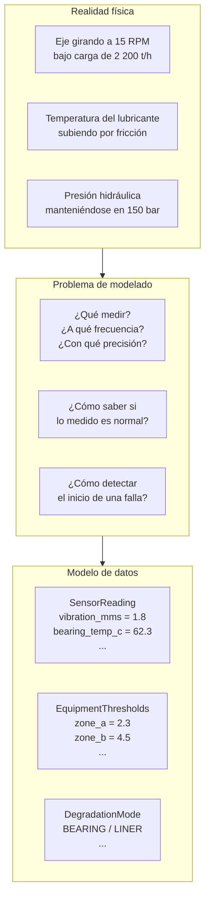

**La pregunta más importante no es qué columnas crear, sino qué fenómeno físico representa cada columna.**

---

## 2. Las cuatro categorías de variables industriales

Todo equipo industrial emite datos que caen en cuatro categorías. Identificarlas correctamente define la estructura del esquema.

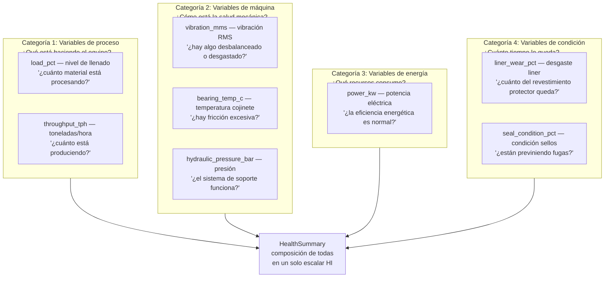

**Por qué importa esta clasificación:**
Las variables de proceso cambian rápido (carga fluctúa cada minuto). Las de máquina cambian lento (temperatura sube en horas). Las de condición cambian muy lento (desgaste en semanas). Esta diferencia de escala temporal determina frecuencia de muestreo, ventanas de análisis y umbrales.

---

## 3. El SAG Mill como caso de estudio: por qué cada variable

### 3.1 Mapa físico del equipo

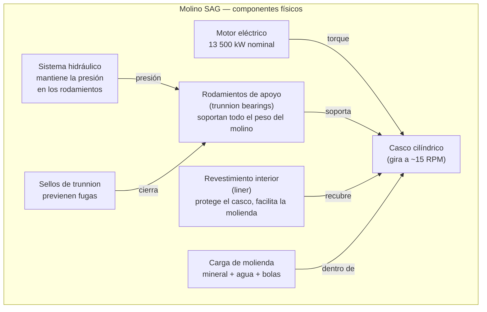

### 3.2 Por qué `vibration_mms` — La variable más importante

```mermaid
flowchart LR
    subgraph FISICA["Física del fenómeno"]
        VF1["Un rodamiento dañado\ncrea impactos periódicos\na frecuencia de defecto"]
        VF2["Un desalineamiento\ncrea vibración al doble\nde la frecuencia de giro 2×RPM"]
        VF3["Desequilibrio de masa\ncrea vibración a 1×RPM\n(frecuencia de giro)"]
    end

    subgraph MEDICION["Por qué mm/s RMS"]
        M1["RMS (Root Mean Square)\npromedio de energía\nno pico aislado"]
        M2["mm/s (velocidad)\ncorrelaciona mejor\ncon daño estructural\nque aceleración o desplazamiento"]
        M3["ISO 10816 estandariza\neste parámetro para\nmaquinaria giratoria"]
    end

    subgraph UMBRAL["Por qué 4 zonas y no 1"]
        U1["Zona A ≤ 2.3\nequipo nuevo: línea base"]
        U2["Zona B ≤ 4.5\naceptable: plan mantenimiento"]
        U3["Zona C ≤ 7.1\ninsatisfactorio: actuar pronto"]
        U4["Zona D > 7.1\npeligro: parada inminente"]
    end

    FISICA --> MEDICION --> UMBRAL
```

**Decisión de modelado:** la vibración necesita **4 umbrales** (no 1) porque el operador necesita saber no solo si hay problema, sino cuánto tiempo tiene para actuar. Esto se modela como `VibrationZones` con 3 valores numéricos que definen 4 regiones.

### 3.3 Por qué `bearing_temp_c` — El precursor de falla más confiable

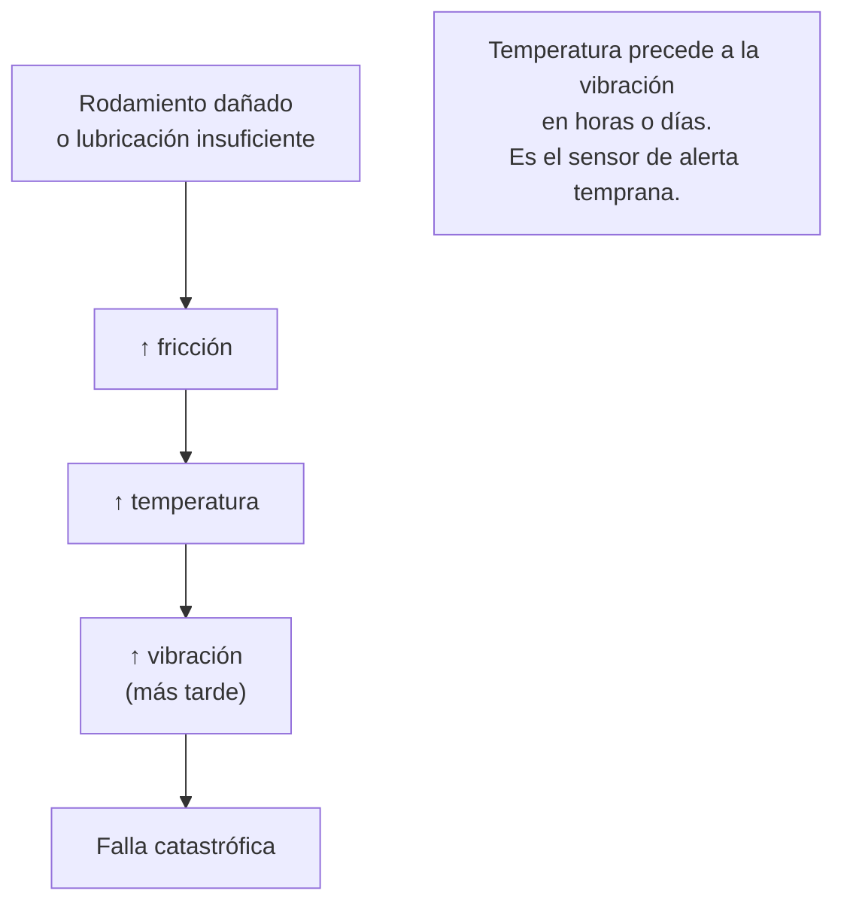

**Decisión de modelado:** los umbrales de temperatura son **trilaterales** (warning / alert / critical), no zonas ISO. Cada nivel tiene una acción distinta asociada: cambiar lubricante, reducir carga, parar el equipo. El modelo usa un dict `{"warning": 72.0, "alert": 82.0, "critical": 92.0}` para máxima legibilidad.

### 3.4 Por qué `hydraulic_pressure_bar` — Variable bilateral

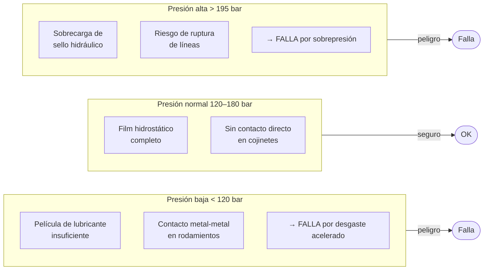

**Decisión de modelado crítica:** la presión hidráulica tiene **dos zonas de peligro** — presión alta Y presión baja son ambas problemáticas. Esto exige que `ThresholdBand` tenga un campo `lower_bound` además de los umbrales superiores. Modelar solo el umbral superior sería un error de dominio que dejaría fugas de presión sin detectar.

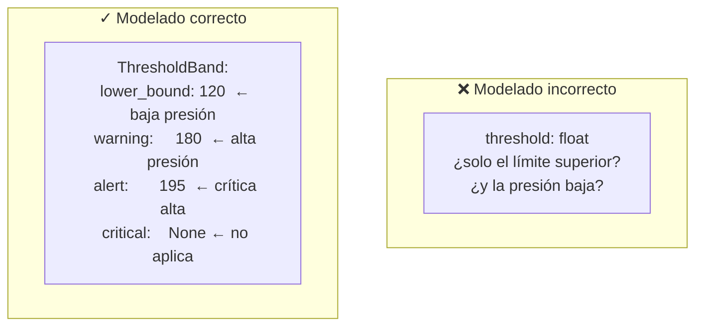

### 3.5 Por qué `power_kw` — El KPI de eficiencia

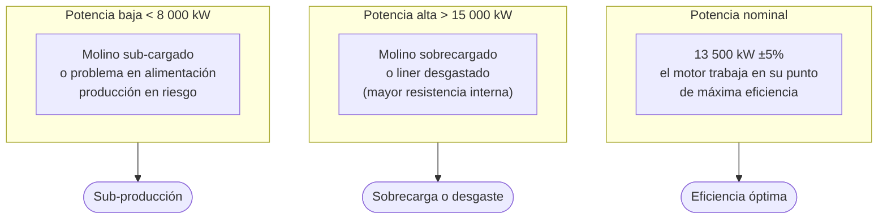

**Decisión de modelado:** la potencia también es bilateral. El punto de referencia no es un umbral, sino el **nominal** del equipo (13 500 kW). El modelo define `{"min", "nominal", "max"}` en lugar de solo umbrales de alarma. El `nominal` se usa para calcular `_power_score()` centrando la función alrededor de ±5% del nominal.

### 3.6 Por qué `load_pct` tiene 4 niveles y no 2

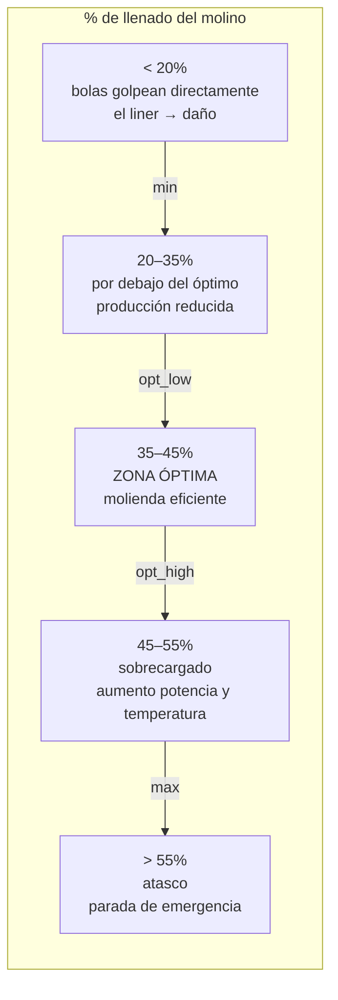

**Decisión de modelado:** `{"min", "opt_low", "opt_high", "max"}` porque el operador tiene cuatro acciones distintas: ajustar alimentación (min/opt_low), operar normalmente (opt_low/opt_high), reducir carga (opt_high/max), parar (>max). Un solo umbral binario perdería toda esta información.

### 3.7 Por qué `liner_wear_pct` y `seal_condition_pct` son opcionales

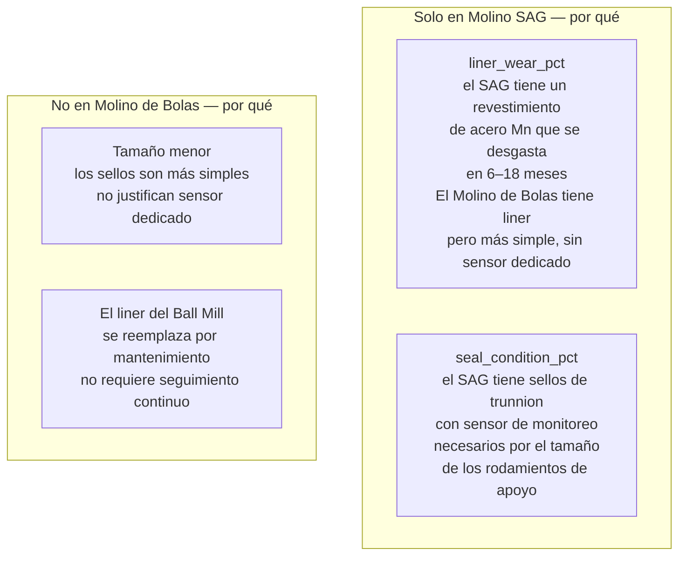

**Decisión de esquema resultante:** campo `NULL`-able en la misma tabla, no tabla separada. El costo de `NULL` en dos columnas es mínimo. El costo de una tabla separada `sag_specific_readings` + JOIN en cada query es significativo para un dashboard en tiempo real.

---

## 4. El concepto de "ventana operativa nominal"

El insight más importante del modelado industrial: cada variable no tiene solo un umbral — tiene una **ventana de operación normal** con topografía propia.

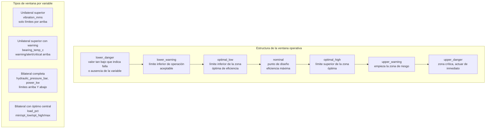

**Regla de modelado:** siempre preguntar para cada variable: ¿puede ser peligrosamente baja? Si sí → necesita `lower_bound`. ¿Tiene una zona óptima distinta de "cualquier valor normal"? Si sí → necesita `opt_low` y `opt_high`.

---

## 5. Modos de degradación: taxonomía de fallas como dato

Uno de los errores más comunes en el modelado industrial es tratar las fallas como eventos binarios (ok/falla). La realidad es que una máquina tiene **modos de falla** distintos, cada uno con su firma de datos propia.

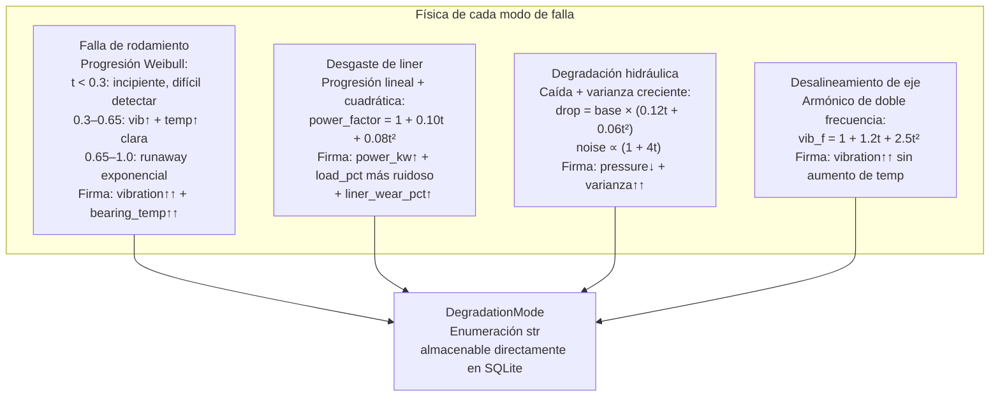

**Por qué modelar el modo de degradación como columna y no solo detectarlo:**

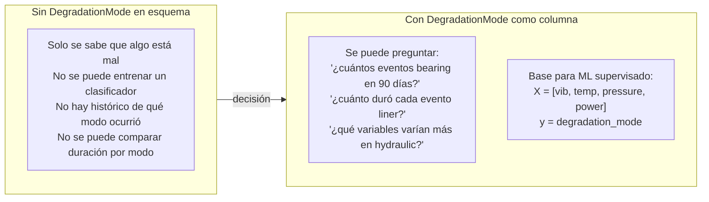

---

## 6. Diseño de esquema: decisiones por tipo de flota

### 6.1 Flota homogénea — mismos sensores en todos los equipos

```mermaid
erDiagram
    EQUIPMENT {
        str id PK "SAG-01, BALL-01"
        str type "SAG | BALL"
        str name
        float nominal_throughput_tph
    }

    READINGS {
        int id PK AUTOINCREMENT
        str equipment_id FK
        datetime timestamp
        float vibration_mms
        float bearing_temp_c
        float hydraulic_pressure_bar
        float power_kw
        float load_pct
        float throughput_tph
        float health_index
        str degradation_mode
    }

    EQUIPMENT ||--o{ READINGS : "tiene muchas"
```

Cuando todos los equipos tienen exactamente las mismas variables: **una sola tabla con `equipment_id`**. La clave compuesta `(equipment_id, timestamp)` es el índice natural.

### 6.2 Flota heterogénea — algunos equipos tienen variables adicionales

Este es el caso exacto del SAG Monitor: SAG-01 tiene `liner_wear_pct` y `seal_condition_pct`, BALL-01 no.

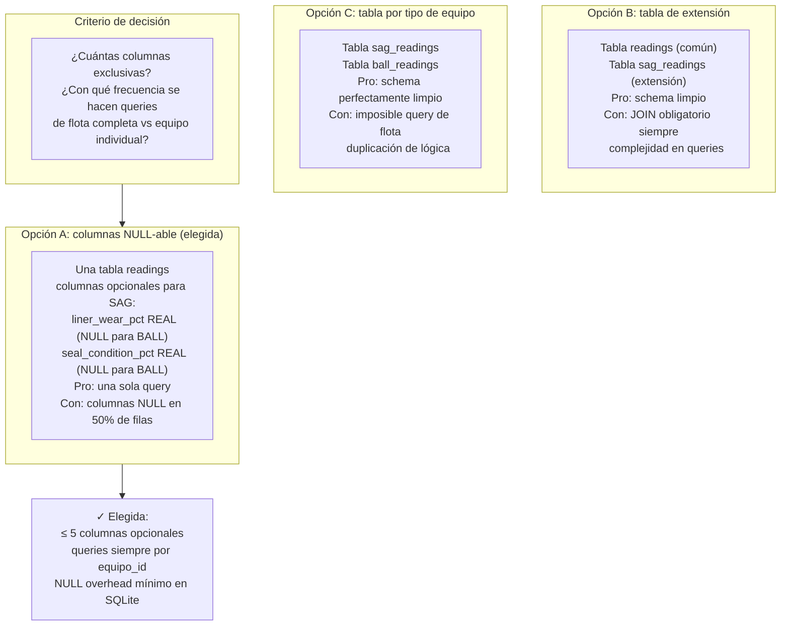

### 6.3 Flota muy heterogénea — muchos tipos distintos

Para flotas con docenas de tipos de equipo muy distintos:

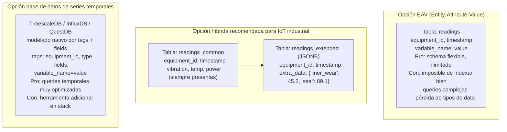

**Regla:** SQLite + columnas NULL funciona bien hasta ~10 variables opcionales. Para flotas con >10 tipos de equipo distintos con >10 variables únicas por tipo, considerar TimescaleDB o JSONB.

---

## 7. Modelado de umbrales: configuración vs. datos

Un error frecuente es mezclar umbrales de configuración con datos operacionales. Son cosas distintas con ciclos de vida distintos.

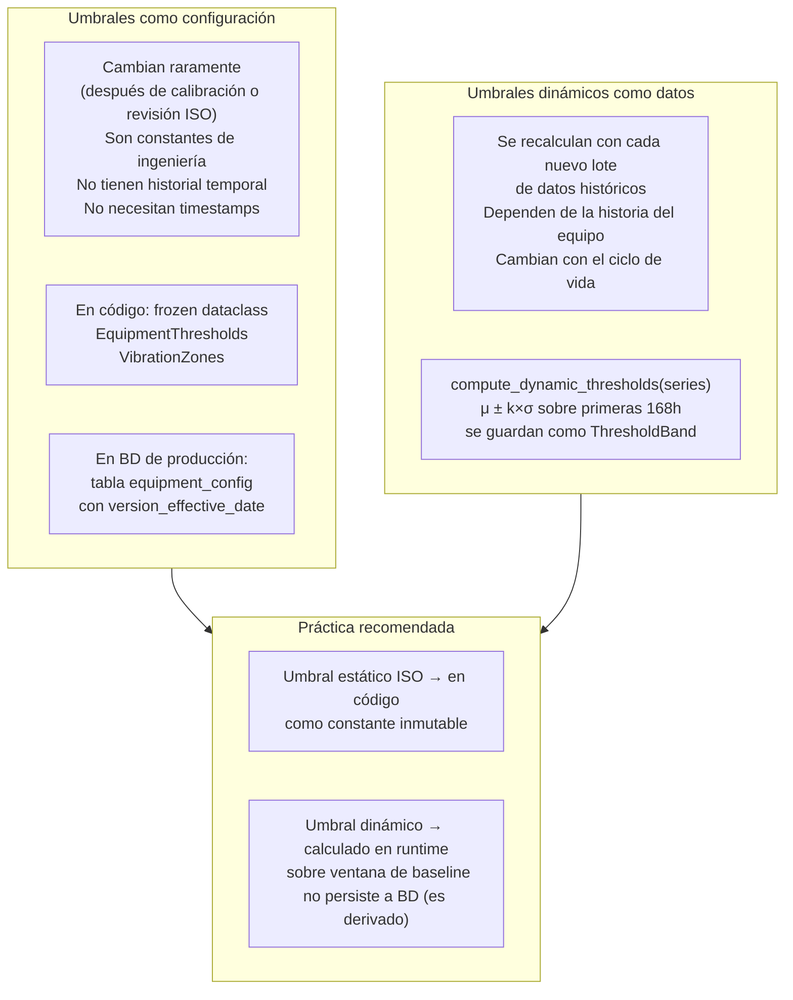

---

## 8. El esquema de eventos (alertas) vs. lecturas continuas

La distinción fundamental que define si el sistema es útil operacionalmente:

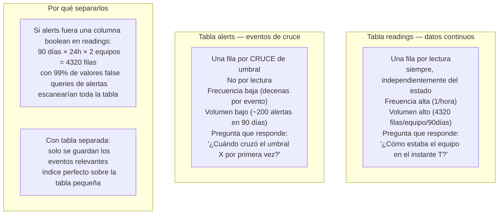

**Cardinalidad típica:**

| Tabla | Filas en 90 días | Ratio |
|---|---|---|
| `readings` | 4 320 por equipo | 1 fila/hora |
| `alerts` | ~50–200 total | ~1 por evento de degradación |

---

## 9. `DegradationStage` — Modelar el progreso, no solo el estado

En sistemas de mantenimiento predictivo el valor está en saber **qué tan avanzada** está la degradación, no solo si está presente.

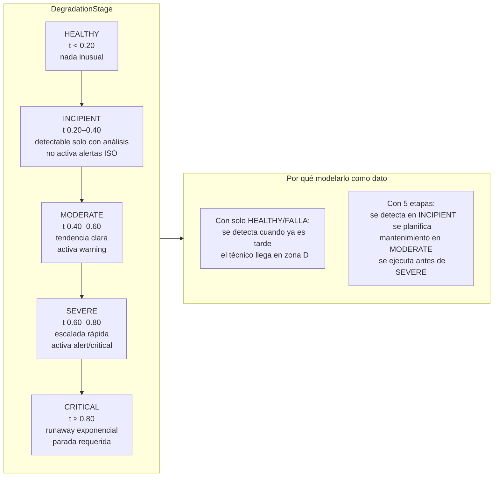

**Nota:** `DegradationStage` en este sistema es interno al simulador (`classify_stage(t)`). En un sistema con datos reales, se puede calcular a partir del HI:

| HI | DegradationStage |
|---|---|
| 80–100 | HEALTHY |
| 60–80 | INCIPIENT |
| 40–60 | MODERATE |
| 20–40 | SEVERE |
| 0–20 | CRITICAL |

---

## 10. Variables derivadas vs. variables primarias

No todas las columnas del esquema son lecturas directas de sensores. Algunas son derivadas.

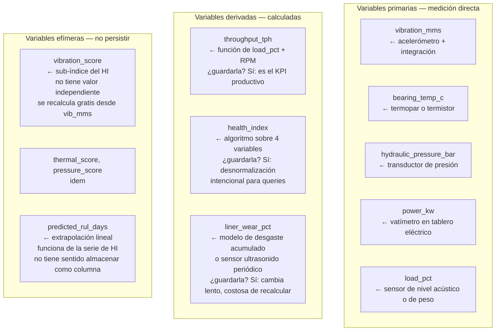

**Regla de persistencia:** guardar una variable derivada si:
1. Su cálculo es costoso (O(n) sobre historia)
2. Es un KPI que se consulta frecuentemente junto a datos primarios
3. Su valor puede cambiar si cambia el algoritmo (en ese caso, recalcular con `force_reseed=True`)

No guardar si: se recalcula en O(1) a partir de datos ya persistidos.

---

## 11. Generalización: plantilla para cualquier equipo industrial

### 11.1 Proceso de modelado en 6 pasos

```mermaid
flowchart TD
    S1["Paso 1: Diagrama físico del equipo\n¿Cuáles son los subsistemas?\n¿Cómo interactúan?\n¿Dónde ocurren las fallas?"]
    S2["Paso 2: Taxonomía de modos de falla\nPara cada subsistema:\n¿Qué puede fallar?\n¿Con qué signature de datos?"]
    S3["Paso 3: Selección de variables\nUna por subsistema crítico\n¿Primaria o derivada?\n¿Unilateral o bilateral?"]
    S4["Paso 4: Definición de ventanas operativas\nPor variable: min, opt_low, nominal\nopt_high, max, critical_high\n¿Fuente: ISO? ¿Fabricante? ¿Histórico?"]
    S5["Paso 5: Diseño del esquema\n¿Flota homogénea o heterogénea?\n¿Frecuencia de muestreo?\n¿Retención de datos?"]
    S6["Paso 6: Diseño del pipeline de eventos\n¿Qué es un 'evento'?\n¿Cómo deduplicar?\n¿Qué acciones dispara?"]

    S1 --> S2 --> S3 --> S4 --> S5 --> S6
```

### 11.2 Plantilla de esquema para cualquier equipo rotativo

```mermaid
erDiagram
    EQUIPMENT_TYPES {
        str type_id PK "SAG, BALL, PUMP, COMPRESSOR"
        str name
        str iso_standard "ISO 10816, ISO 13381, ..."
        json threshold_template "umbrales por defecto del tipo"
    }

    EQUIPMENT {
        str id PK "SAG-01, PUMP-03"
        str type_id FK
        str location
        float nominal_throughput
        datetime commissioned_date
        json custom_thresholds "overrides del template"
    }

    READINGS {
        int id PK
        str equipment_id FK
        datetime timestamp
        float vibration_mms
        float bearing_temp_c
        float power_kw
        float health_index
        str degradation_mode
        json extra_variables "para variables específicas del tipo"
    }

    FAILURE_MODES {
        str id PK "bearing, liner, hydraulic"
        str equipment_type_id FK
        str name
        str primary_indicator "variable más afectada"
        str progression_model "weibull, linear, exponential"
    }

    ALERTS {
        str id PK "UUID"
        str equipment_id FK
        datetime timestamp
        str severity
        str failure_mode_id FK
        str variable
        float value
        float threshold
        bool acknowledged
    }

    EQUIPMENT_TYPES ||--o{ EQUIPMENT : "instancias de"
    EQUIPMENT ||--o{ READINGS : "genera"
    EQUIPMENT_TYPES ||--o{ FAILURE_MODES : "puede tener"
    EQUIPMENT ||--o{ ALERTS : "genera"
    FAILURE_MODES ||--o{ ALERTS : "clasifica"
```

### 11.3 Aplicar la plantilla a otros equipos

| Equipo | Vibración | Temperatura | Presión | Potencia | Variable específica |
|---|---|---|---|---|---|
| SAG Mill (este proyecto) | vibration_mms | bearing_temp_c | hydraulic_pressure_bar | power_kw | liner_wear_pct, seal_condition_pct |
| Bomba centrífuga | vibration_mms | bearing_temp_c | discharge_pressure_bar | power_kw | flow_rate_m3h, suction_pressure_bar |
| Compresor de tornillo | vibration_mms | outlet_temp_c | discharge_pressure_bar | power_kw | oil_pressure_bar, intercooler_temp_c |
| Ventilador industrial | vibration_mms | bearing_temp_c | — | power_kw | blade_angle_deg, airflow_m3s |
| Correa transportadora | — | drive_temp_c | — | power_kw | belt_tension_n, tracking_offset_mm |

La estructura del esquema es la misma. Solo cambian los valores de los umbrales y las columnas `extra_variables` o los campos opcionales.
