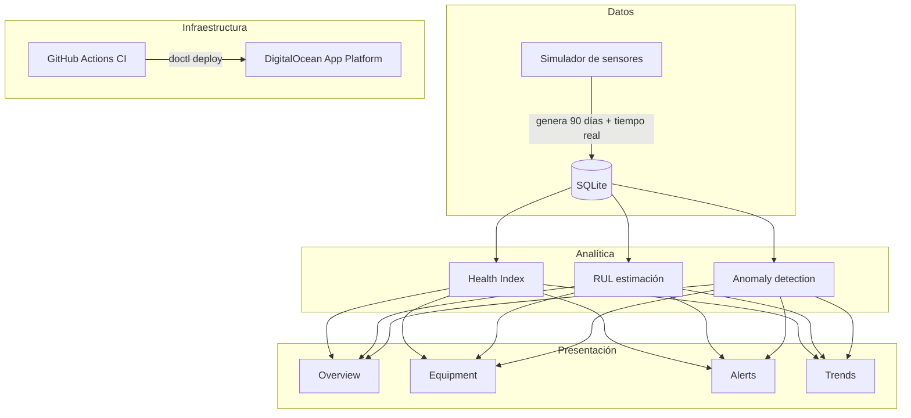

# Documentación — SAG Monitor

Documentación técnica completa del sistema de monitoreo predictivo de flotas de molienda.

---

## Índice

| Documento | Contenido |
|---|---|
| [architecture.md](architecture.md) | Arquitectura del sistema, flujo de datos, modelos de dominio |
| [dev-workflow.md](dev-workflow.md) | Guía de desarrollo: flujo nativo (venv) y flujo Docker |
| [equipment-modeling.md](equipment-modeling.md) | Modelado de equipos industriales: por qué cada variable, umbrales, plantilla general |
| [data-model.md](data-model.md) | Modelo de datos: clases, decisiones de diseño, esquema SQLite |
| [data-flow.md](data-flow.md) | Pipelines batch y tiempo real, `compute_health_summary × N`, arquitectura de datos |
| [analytics.md](analytics.md) | Motor analítico: Índice de Salud, RUL, detección de anomalías |
| [cicd.md](cicd.md) | Pipeline CI/CD, GitHub Actions, estructura del workflow |
| [deployment.md](deployment.md) | DigitalOcean App Platform: configuración, secrets, operación |
| [troubleshooting/index.md](troubleshooting/index.md) | Issues conocidos y sus soluciones (TS-01 … TS-08) |

---

## Vista de alto nivel

---

## Archivos de configuración clave

| Archivo | Propósito |
|---|---|
| `.env.example` | Plantilla de variables de entorno |
| `pyproject.toml` | Configuración de ruff, mypy, pytest, coverage |
| `Dockerfile` | Imagen de producción `python:3.12-slim` |
| `docker-compose.yml` | Stack local con volumen SQLite persistente |
| `.do/app.yaml` | Spec declarativo de DigitalOcean App Platform |
| `.github/workflows/ci.yml` | Pipeline CI/CD de GitHub Actions |
| `Makefile` | Comandos de desarrollo local (Ubuntu/WSL/macOS) |
