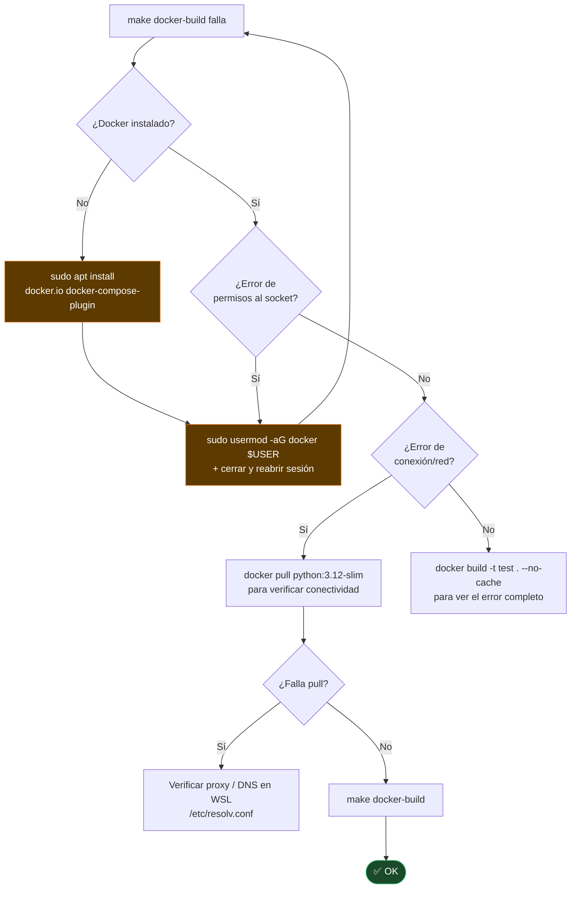

# Troubleshooting — SAG Monitor

> Los diagramas Mermaid se renderizan en GitHub, VS Code (extensión Markdown Preview Mermaid), y Obsidian.

---

## 1. `make install` falla en WSL sobre drive de Windows

### Síntoma

```
Error: [Errno 1] Operation not permitted: 'lib' -> '.venv/lib64'
```

### Causa


**NTFS** (drives `/mnt/c/`, `/mnt/d/`, `/mnt/e/`, etc.) no soporta symlinks POSIX por defecto en WSL. Python 3.12 crea `lib64 → lib` incondicionalmente en sistemas 64-bit y no captura el `EPERM`.

### Árbol de decisión


### Solución aplicada en el Makefile

```python
# El Makefile ejecuta este one-liner al detectar WSL + /mnt/X/
import venv, os
_o = os.symlink
os.symlink = lambda s, d, *a, **k: None if 'lib64' in d else _o(s, d, *a, **k)
venv.EnvBuilder(with_pip=True, symlinks=False).create('.venv')
```

**Porqué funciona:**
- `symlinks=False` → Python copia los binarios en lugar de enlazarlos (evita EPERM en `bin/`)
- El patch de `os.symlink` → solo silencia el symlink `lib64 → lib`, el único que falla en NTFS
- `with_pip=True` → usa `ensurepip` (incluido en `python3.12-venv`) sin necesitar pip del sistema

### Alternativa permanente — habilitar symlinks en WSL


```ini
# /etc/wsl.conf
[automount]
options = "metadata"
```

---

## 2. `python3.12: No module named pip`

### Síntoma

```
/usr/bin/python3.12: No module named pip
```

### Causa y solución


En Ubuntu, `python3.12` desde apt **no incluye pip** como módulo del sistema. La solución del Makefile usa `venv.EnvBuilder(with_pip=True)` que llama a `ensurepip` internamente (distinto al `python3.12 -m ensurepip` del sistema, que sí puede estar bloqueado).

---

## 3. `make install` falla con error de permisos en pip upgrade

### Síntoma

```
ERROR: Could not install packages due to an OSError
```

### Diagnóstico


---

## 4. Docker build falla localmente

### Síntoma

```
ERROR [internal] load metadata for docker.io/library/python:3.12-slim
```
o
```
permission denied while trying to connect to the Docker daemon
```

### Árbol de diagnóstico



---

## 5. La app arranca pero muestra pantalla en blanco

### Síntoma

`make run` ejecuta sin errores pero `http://localhost:8050` no muestra nada.

### Diagnóstico


---

## 6. CI falla en GitHub Actions

### Anatomía del pipeline y puntos de falla


### Errores comunes

| Error en CI | Causa más probable | Solución |
|---|---|---|
| `ruff check` falla | Código sin formatear | `make format` y hacer commit |
| `mypy` falla | Error de tipos | `make typecheck` localmente para ver detalle |
| `pytest` falla | Test roto o import faltante | `make test` localmente |
| `docker build` falla | `requirements.txt` incompatible | Probar `make docker-build` local |
| `doctl` falla | Secret `DIGITALOCEAN_ACCESS_TOKEN` ausente o expirado | Renovar token en DO y actualizar en GitHub Secrets |

---

## Referencia rápida de comandos de diagnóstico

```bash
# Verificar entorno
python3.12 --version
python3.12 -c "import venv; print('venv OK')"
which pip                        # debe ser .venv/bin/pip

# Entorno WSL
cat /proc/version                # muestra si es WSL
pwd                              # debe ser /mnt/X/... si estás en drive Windows
ls -la .venv/lib/                # verificar que lib existe
ls -la .venv/lib64 2>/dev/null   # normalmente no existe en WSL+NTFS (OK)

# Docker
docker version
docker compose version
groups | grep docker             # debe aparecer 'docker'

# CI local
make check                       # lint + format + types + tests
make docker-build                # validar Dockerfile localmente
```
