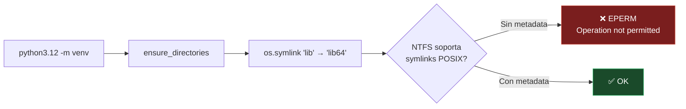
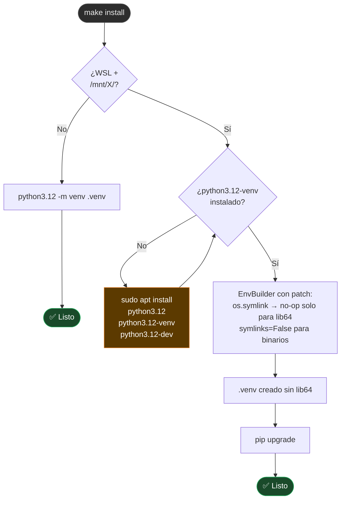

# TS-01 — `make install` falla en WSL sobre drive de Windows

## Síntoma

```
Error: [Errno 1] Operation not permitted: 'lib' -> '.venv/lib64'
```

## Causa



**NTFS** (drives `/mnt/c/`, `/mnt/d/`, `/mnt/e/`, etc.) no soporta symlinks POSIX por defecto en WSL. Python 3.12 crea `lib64 → lib` incondicionalmente en sistemas 64-bit y no captura el `EPERM`.

## Árbol de decisión



## Solución aplicada en el Makefile

```python
# El Makefile ejecuta este one-liner al detectar WSL + /mnt/X/
import venv, os
_o = os.symlink
os.symlink = lambda s, d, *a, **k: None if 'lib64' in d else _o(s, d, *a, **k)
venv.EnvBuilder(with_pip=True, symlinks=False).create('.venv')
```

**Por qué funciona:**
- `symlinks=False` → Python copia los binarios en lugar de enlazarlos (evita EPERM en `bin/`)
- El patch de `os.symlink` → solo silencia el symlink `lib64 → lib`, el único que falla en NTFS
- `with_pip=True` → usa `ensurepip` (incluido en `python3.12-venv`) sin necesitar pip del sistema

## Alternativa permanente — habilitar symlinks en WSL


```ini
# /etc/wsl.conf
[automount]
options = "metadata"
```

---

← [Índice de troubleshooting](index.md)
