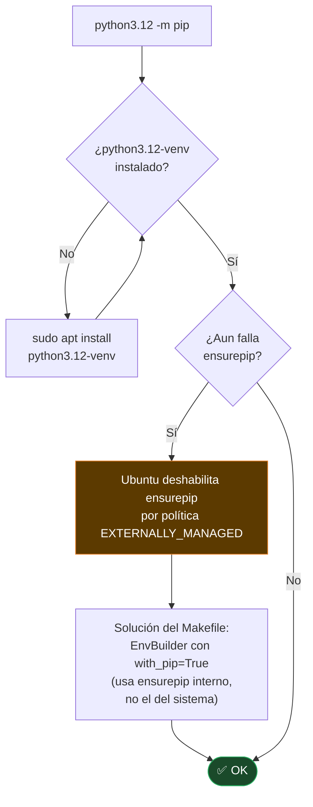

# TS-02 — `python3.12: No module named pip`

## Síntoma

```
/usr/bin/python3.12: No module named pip
```

## Causa y solución



En Ubuntu, `python3.12` desde apt **no incluye pip** como módulo del sistema. La solución del Makefile usa `venv.EnvBuilder(with_pip=True)` que llama a `ensurepip` internamente (distinto al `python3.12 -m ensurepip` del sistema, que sí puede estar bloqueado).

---

← [Índice de troubleshooting](index.md)
