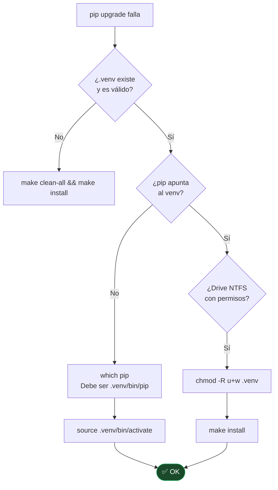

# TS-03 — `make install` falla con error de permisos en pip upgrade

## Síntoma

```
ERROR: Could not install packages due to an OSError
```

## Diagnóstico



---

← [Índice de troubleshooting](index.md)
