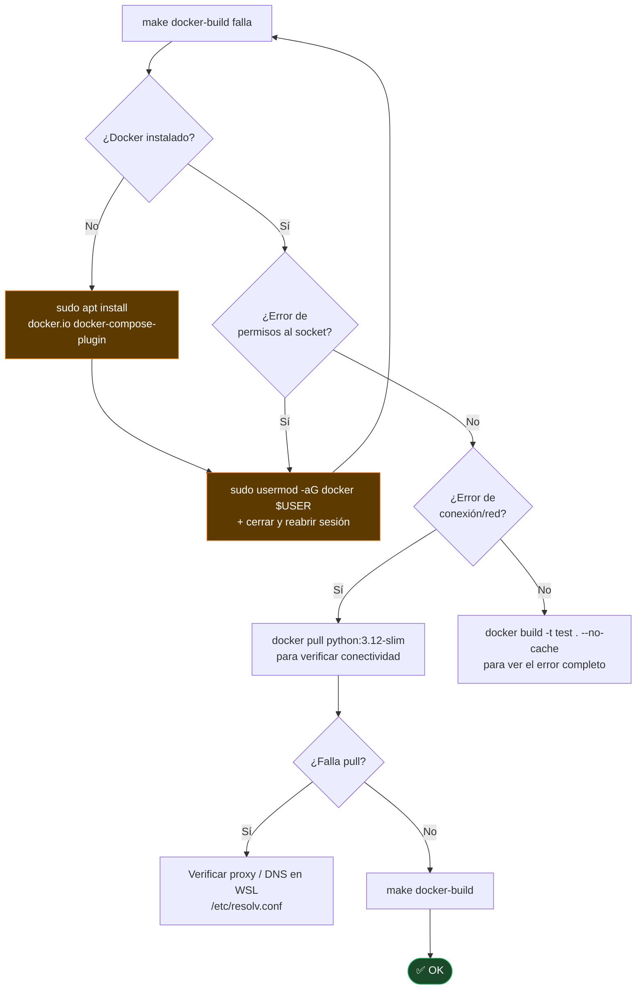

# TS-04 — Docker build falla localmente

## Síntoma

```
ERROR [internal] load metadata for docker.io/library/python:3.12-slim
```
o
```
permission denied while trying to connect to the Docker daemon
```

## Árbol de diagnóstico



---

← [Índice de troubleshooting](index.md)
