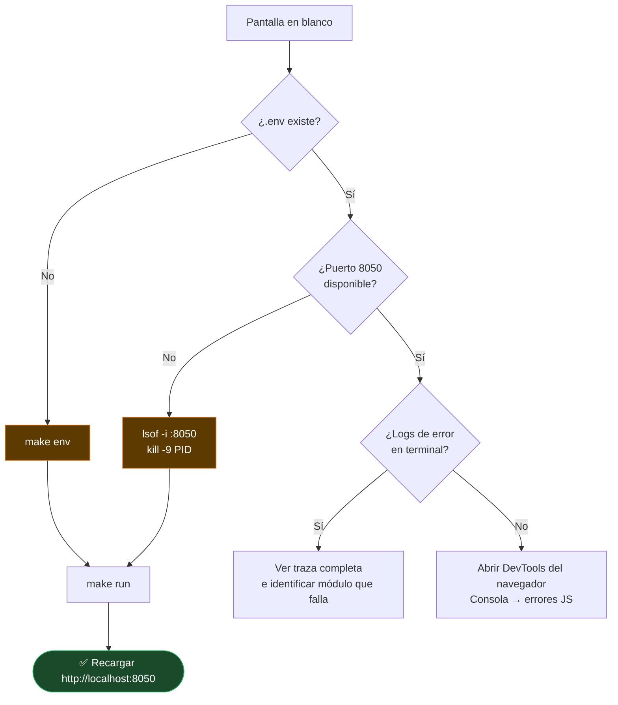

# TS-05 — La app arranca pero muestra pantalla en blanco

## Síntoma

`make run` ejecuta sin errores pero `http://localhost:8050` no muestra nada.

## Diagnóstico

---

← [Índice de troubleshooting](index.md)
