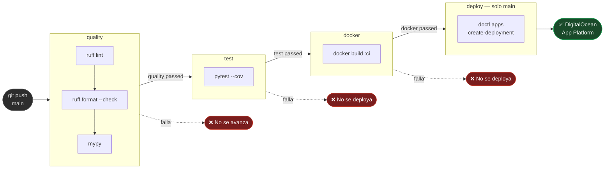

# TS-06 — CI falla en GitHub Actions

## Anatomía del pipeline y puntos de falla

## Errores comunes

| Error en CI | Causa más probable | Solución |
|---|---|---|
| `ruff check` falla | Código sin formatear o imports desordenados | `make format && make lint` y hacer commit |
| `mypy` falla | Error de tipos | `make typecheck` localmente para ver detalle |
| `pytest` falla | Test roto o import faltante | `make test` localmente |
| `docker build` falla | `requirements.txt` incompatible | Probar `make docker-build` local |
| `doctl` falla | Secret `DIGITALOCEAN_ACCESS_TOKEN` ausente o expirado | Renovar token en DO y actualizar en GitHub Secrets |

---

← [Índice de troubleshooting](index.md)
