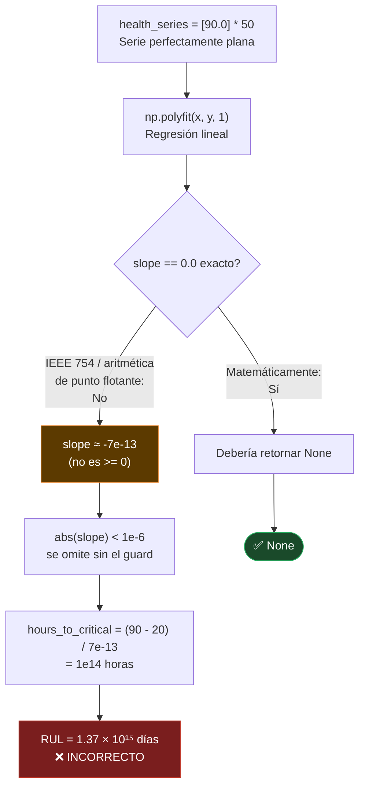
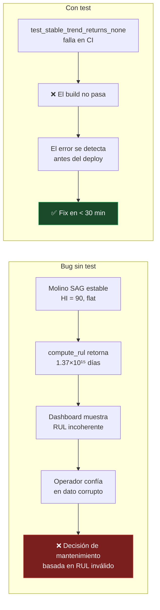

# TS-07 — `compute_rul` retorna valor astronómico en serie estable (bug de precisión flotante)

## Síntoma reproducible

```
FAILED tests/test_health_index.py::TestComputeRUL::test_stable_trend_returns_none
E  assert np.float64(1374398530379855.2) is None
```

El test entrega una serie perfectamente plana (`[90.0] * 50`) y espera `None`.  
La función devuelve ~**1.37 × 10¹⁵ días** de RUL en su lugar.

## Diagrama de causa raíz



## Causa raíz

`numpy.polyfit` asigna internamente una pseudoinversa de mínimos cuadrados usando aritmética IEEE 754. Para una serie de valores idénticos, la solución analítica exacta es `slope = 0.0`, pero las operaciones de punto flotante acumulan un residuo del orden de **10⁻¹³**. Este residual es negativo en esta instancia, por lo que la guarda `if slope >= 0` no se activa, y la división `(hi_actual - umbral_crítico) / |slope|` produce un número de escala planetaria.

## Fix aplicado

```python
# ANTES — no captura pendientes negativas casi-cero
if slope >= 0:
    return None

# DESPUÉS — epsilon guard: cualquier degradación < 1e-6 HI/hora es ruido numérico
if slope >= -1e-6:
    # Estable o mejorando — sin proyección RUL significativa
    return None
```

El umbral `1e-6 HI/hora` equivale a una pérdida de salud de **0.0001 puntos por día**, cuatro órdenes de magnitud por debajo de cualquier tasa de degradación real observada en los datos simulados (~0.2–2.0 HI/hora en eventos de falla).

## Por qué este test es crítico



Este defecto ilustra una clase de error silencioso que **solo una suite de tests puede detectar**: la función no crashea, no lanza excepción, y devuelve un número válido. Sin el test, el bug habría llegado a producción invisiblemente.

## Impacto operacional en contexto minero

| Módulo testeado | Test representativo | Consecuencia si falla silenciosamente |
|---|---|---|
| `compute_rul` | `test_stable_trend_returns_none` | RUL fantasma bloquea decisiones de mantenimiento predictivo |
| `compute_health_summary` | `test_degraded_reading_low_hi` | Equipo en falla incipiente muestra HI = 95 → no se genera alerta |
| `_vibration_score` | `test_zone_d_gives_low_score` | Vibración crítica clasificada como zona A → falso negativo de RCM |
| `derive_alerts` | `test_alerts_for_degraded_readings` | Falla activa no genera alerta → sin notificación a sala de control |
| `SensorReading` (validación) | `test_vibration_bounds` | Lectura fuera de rango persiste en BD sin rechazo |
| `generate_history` | `test_contains_degradation_events` | Historial sin degradación → modelo entrenado en datos ideales |
| `ThresholdBand` | `test_warning_above_alert` | Umbral warning > alert → lógica de semáforo invertida en UI |

En minería, el costo de un falso negativo (no detectar degradación real) puede superar USD 500 K/día en pérdida de producción. El costo de un falso positivo (alerta innecesaria) es una mantención preventiva de USD 20–80 K. La asimetría de costos hace que los tests de comportamiento en condiciones límite sean **parte del sistema de gestión de riesgos**.

---

← [Índice de troubleshooting](index.md)
