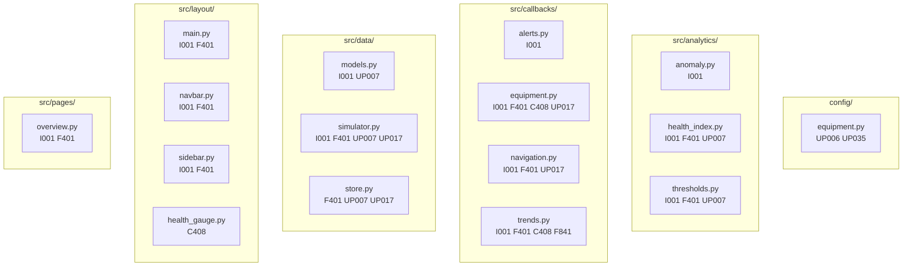

# TS-08 — 97 errores de linting ruff en `make check`

## Síntoma

```
$ make check
...
Found 97 errors.
[*] 69 fixable with the `--fix` option (27 hidden fixes can be enabled with the `--unsafe-fixes` option).
make: *** [Makefile:78: lint] Error 1
```

## Causa

Acumulación de deuda técnica de estilo en múltiples módulos. Los errores eran todos estáticos (sin cambio de lógica), distribuidos en 16 archivos.

## Inventario de errores por categoría

| Código | Regla | Descripción | Archivos afectados |
|---|---|---|---|
| `I001` | Import sorting | Bloque de imports sin ordenar | `app.py`, `src/analytics/anomaly.py`, `src/analytics/health_index.py`, `src/analytics/thresholds.py`, `src/callbacks/*.py`, `src/data/*.py`, `src/layout/*.py`, `src/pages/*.py` |
| `F401` | Unused import | Import declarado pero no usado | `src/analytics/health_index.py`, `src/callbacks/equipment.py`, `src/callbacks/navigation.py`, `src/callbacks/trends.py`, `src/data/store.py`, `src/layout/main.py`, `src/layout/navbar.py`, `src/layout/sidebar.py`, `src/pages/overview.py` |
| `UP006` | Deprecated `Dict` | `typing.Dict` → `dict` | `config/equipment.py` |
| `UP007` | Deprecated `Optional` | `Optional[X]` → `X \| None` | `src/analytics/health_index.py`, `src/analytics/thresholds.py`, `src/data/models.py`, `src/data/simulator.py`, `src/data/store.py` |
| `UP017` | `timezone.utc` → `datetime.UTC` | Alias moderno de UTC | `src/callbacks/equipment.py`, `src/callbacks/navigation.py`, `src/data/simulator.py`, `src/data/store.py` |
| `UP035` | Deprecated `typing.Dict` import | `from typing import Dict` → eliminado | `config/equipment.py` |
| `C408` | Unnecessary `dict()` call | `dict(k=v)` → `{"k": v}` | `src/callbacks/equipment.py`, `src/callbacks/trends.py`, `src/layout/components/health_gauge.py` |
| `F841` | Unused variable | Variable asignada pero nunca usada | `src/callbacks/trends.py` (`color_rgba`) |

## Diagrama de archivos afectados



## Imports eliminados (F401)

Los siguientes imports existían en el código pero no eran referenciados:

| Archivo | Import eliminado |
|---|---|
| `src/analytics/health_index.py` | `datetime`, `timezone`, `EQUIPMENT_CONFIG`, `DegradationMode` |
| `src/analytics/thresholds.py` | `numpy`, `EQUIPMENT_CONFIG` |
| `src/callbacks/equipment.py` | `State`, `dcc`, `SEVERITY_COLORS`, `kpi_card` |
| `src/callbacks/navigation.py` | `plotly.graph_objects`, `get_static_thresholds`, `get_value_color` |
| `src/callbacks/trends.py` | `numpy` |
| `src/data/simulator.py` | `classify_stage` |
| `src/data/store.py` | `json`, `Path` |
| `src/layout/main.py` | `dash_bootstrap_components` |
| `src/layout/navbar.py` | `dcc` |
| `src/layout/sidebar.py` | `dcc` |
| `src/pages/overview.py` | `dcc`, `health_gauge`, `kpi_card` |

## Solución aplicada

```bash
# Un solo comando corrigió los 97 errores
ruff check . --fix --unsafe-fixes
```

- `--fix`: aplica las 69 correcciones automáticas seguras
- `--unsafe-fixes`: aplica las 28 correcciones adicionales que ruff clasifica como "unsafe" (en este caso, todas eran cambios de tipo seguros: `Optional[X]` → `X | None`, `Dict` → `dict`, `timezone.utc` → `datetime.UTC`)

## Verificación

```bash
$ ruff check .
All checks passed!
```

## Lección aprendida

Estos errores se acumularon gradualmente al agregar funcionalidad nueva. El flujo correcto es correr `make check` (o `make lint`) **antes** de hacer commit, no solo en CI. Configurar el editor para lint-on-save con ruff previene esta acumulación:

```json
// .vscode/settings.json
{
  "[python]": {
    "editor.formatOnSave": true,
    "editor.codeActionsOnSave": {
      "source.fixAll.ruff": "explicit",
      "source.organizeImports.ruff": "explicit"
    }
  }
}
```

---

← [Índice de troubleshooting](index.md)
